# 购物车模块-接口说明

## 一、购物车模块概述：	

​	购物车模块主要提供用户本产品的基础。购物车模块提供一下功能：

>添加购物车
>
>查询购物车
>
>删除购物车
>
>购物车商品数量添加/减少
>
>购物车商品单选/取消单选
>
>购物车商品全选/取消全选
>
>合并购物车

## 二、事件定义

### 添加购物车

​		用户未登陆状态下进入商品详情页，选择规格和数量，将商品加入到购物车，数据将保存到前端的浏览器的本地存储里。

​		用户登陆状态下进入商品详情页，选择规格和数量，将商品加入到购物车，前端会通过ajax进行与后端交互。

### 查询购物车

​		用户未登录状态下进入购物车页面，前端通过浏览器的本地存储保存的数据展示给用户。

​		用户登录状态下进入购物车页面，后端通过redis存好的商品数据，传给前端展示给用户。

### 删除购物车

​		用户进入购物车页面，点击购物车某个商品删除按钮，会有一个弹框显示确定删除和不删除，点击确定删除按钮，商品会被删除。

### 购物车商品

​		商品数量增加和减少： 用户进入购物车页面，点击商品 “+” 按钮，将商品数量增加1个。点击商品 “-” 按钮，将商品数量减少1个。

​		商品单选和取消单选：用户进入购物车页面，默认进入购物车页面单选是 ”√“ ，取消单件商品点击单选按钮，按钮显示空，选择单件商品点击单选按钮，按钮显示 ”√“。

​		商品全选和取消全选：用户进入购物车页面，默认进入购物车页面全选是 ”√“ ，取消全部商品点击全选按钮，按钮显示空，选择全部商品点击全选按钮，按钮显示 ”√“。

### 合并购物车

​		用户在登陆时，创建token，会将用户未登陆状态下浏览器本地存储的购物车商品数据传给后端，后端通过redis存储的商品数量，做数量比较将商品数量最多的存入redis，返还给前端显示。


## 三、API接口说明

### 1.添加购物车

在登陆的状态下添加购物车

#### 事件触发：

页面名：**product_details.html**

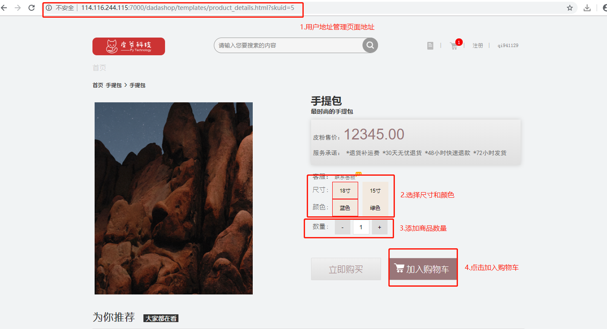

#### 触发结果：

​	触发成功：

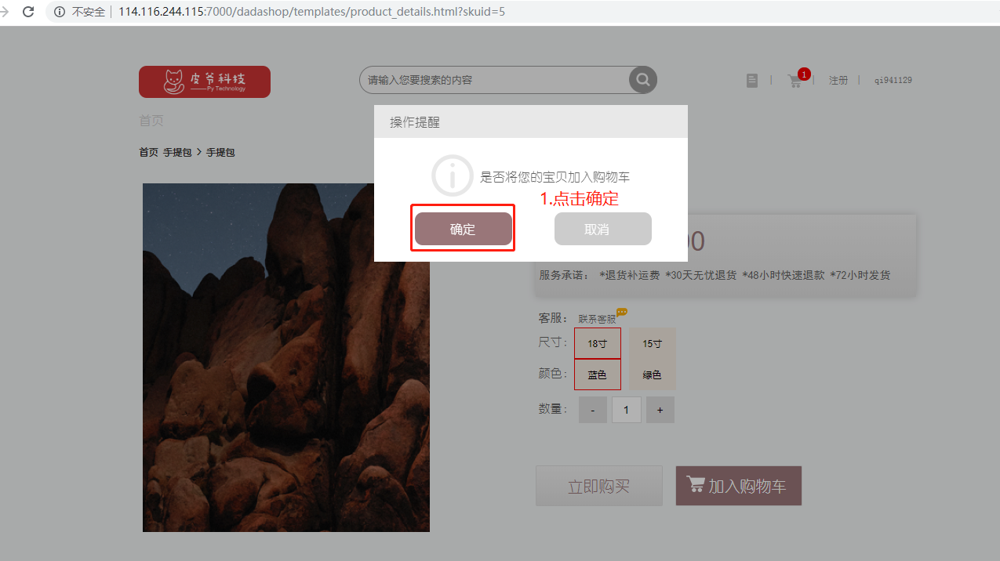

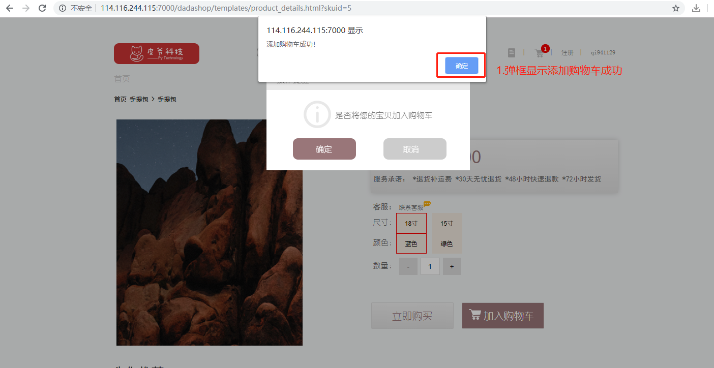

​	触发失败：


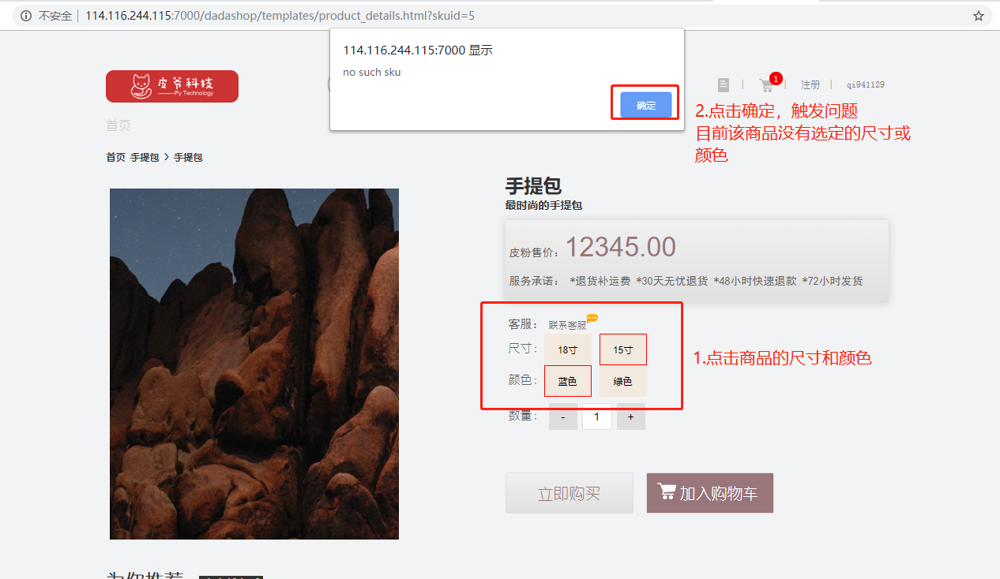


**URL**： ``127.0.0.1:8000/v1/carts/<username> ``

**请求方式**：POST

**请求参数**：JSON

|  参数  | 类型 | 是否必须 |     说明     |
| :----: | :--: | :------: | :----------: |
| sku_id | int  |    是    |  商品sku_id  |
| count  | int  |    是    | 单个商品数量 |


**返回值**：JSON

**响应格式**：

```
# 正确响应：
{'code': 200, 'data': {'carts_count': count}, 'base_url': PIC_URL}
# 错误响应：
{"code":xxx,"error":xxx}
```

|   字段   |     含义     | 类型 | 备注                        |
| :------: | :----------: | :--: | --------------------------- |
|   code   |    状态码    | int  | 默认正常为200，异常见状态码 |
|   data   |   具体数据   | dict | 与error二选一               |
|  error   |   错误信息   | char | 与data二选一                |
| base_url | 图片存储路径 | char | 成功返回图片存储路径        |

```
base_url 例子
http://127.0.0.1:8000/media/
```


data 参数信息

| 参数        | 类型 | 是否必须 | 说明             |
| ----------- | ---- | -------- | ---------------- |
| carts_count | int  | 是       | 购物车里数量长度 |


状态码参数：

| 状态码 | 响应信息         | 原因短句                    |
| ------ | ---------------- | --------------------------- |
| 200    | 正常             | OK                          |
| 30101  | 未找到商品       | SKU query error             |
| 30102  | 传参不正确       | Incorrect pass of reference |
| 30103  | 购买数量超过库存 | exceeds the inventory       |
| 30104  | 未找到用户       | User query error            |


### 2.查询购物车

#### 事件触发:

页面名：**index.html**

页面名：**cart.html** 

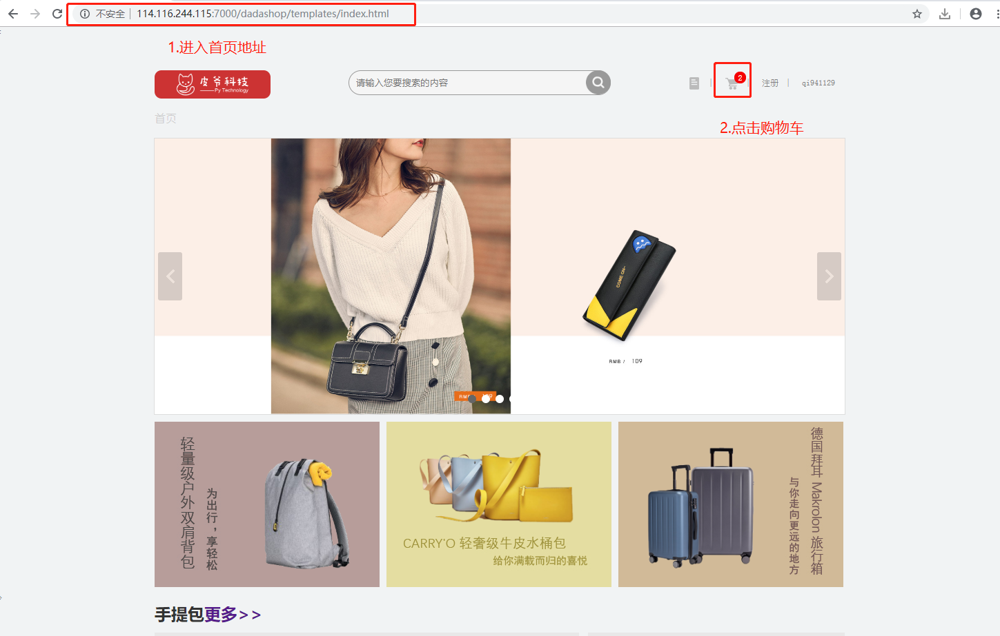

#### 触发结果:

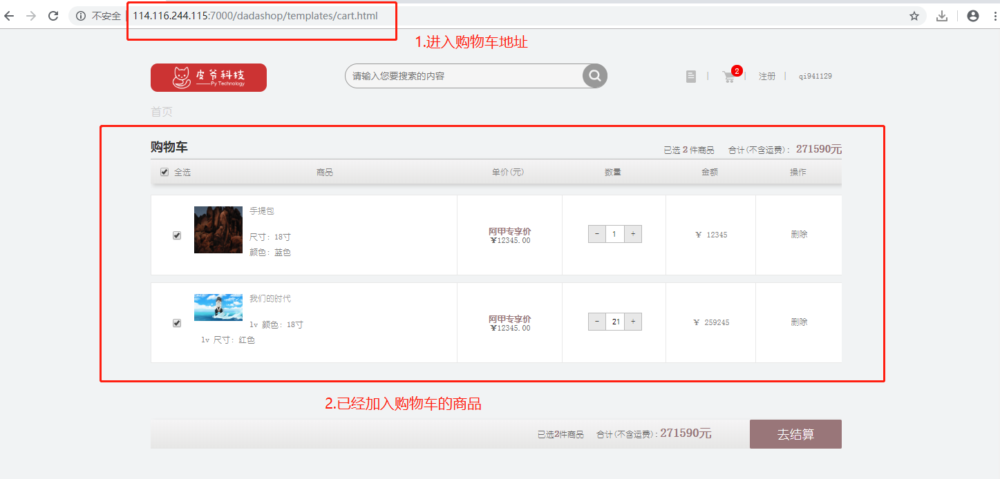


**URL**： 127.0.0.1:8000/v1/carts/<username>

**请求方式**: GET

**请求参数**：无

**返回值**：JSON

**响应格式**：

```
# 正常响应： 
{'code': 200, 'data': skus_list, 'base_url': PIC_URL}

# 异常响应
{"code":xxx,"error"：xxxx}
```


|   字段   |     含义     | 类型 | 备注                        |
| :------: | :----------: | :--: | --------------------------- |
|   code   |    状态码    | int  | 默认正常为200，异常见状态码 |
|   data   |   具体数据   | dict | 与error二选一               |
|  error   |   错误信息   | char | 与data二选一                |
| base_url | 图片存储路径 | char | 成功返回图片存储路径        |

```
base_url 例子
http://127.0.0.1:8000/media/
```


skus_list参数信息

| 参数               | 类型    | 是否必须 | 说明                             |
| ------------------ | ------- | -------- | -------------------------------- |
| id                 | int     | 是       | 商品sku_id                       |
| name               | str     | 是       | 商品名称                         |
| count              | int     | 是       | 单个商品数量                     |
| default_image_url  | str     | 是       | 商品默认图片路径                 |
| price              | decimal | 是       | 商品单价                         |
| sku_sale_attr_name | list    | 是       | 商品属性                         |
| sku_sale_attr_val  | list    | 是       | 商品属性值                       |
| selected           | int     | 是       | 商品的选中状态（0未选中，1选中） |

```python
#skus_list中数据示例 [{"id":"","name":"","count":"","selected":"","default_image_url":"","price":"","sku_sale_attr_name":[],"sku_sale_attr_val":[]},{"":""...}]

#注：
sku_sale_attr_name = ["尺寸"，"颜色"]
sku_sale_attr_val = ["18寸","蓝色"]
```


状态码参数

| 状态码 | 响应信息   | 原因短语         |
| ------ | ---------- | ---------------- |
| 200    | 正常       | OK               |
| 30104  | 未找到用户 | User query error |


### 3.删除购物车数据

#### 事件触发:

页面名：**cart.html** 

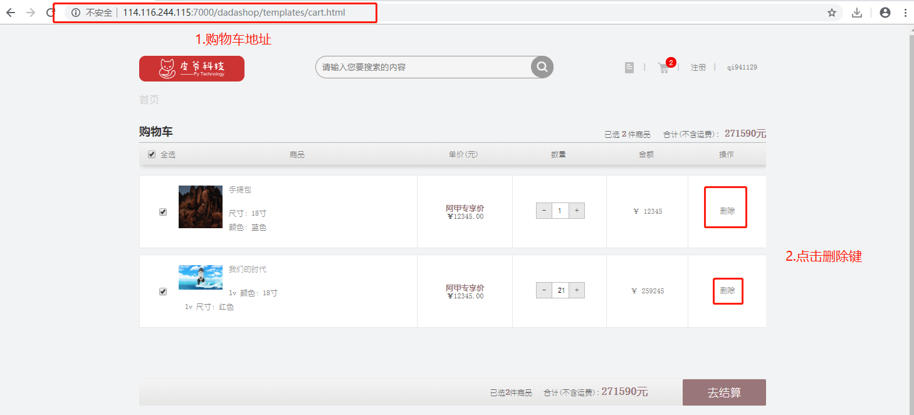

#### 触发结果:

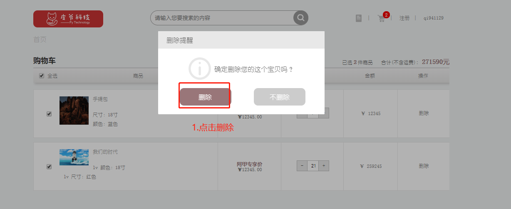

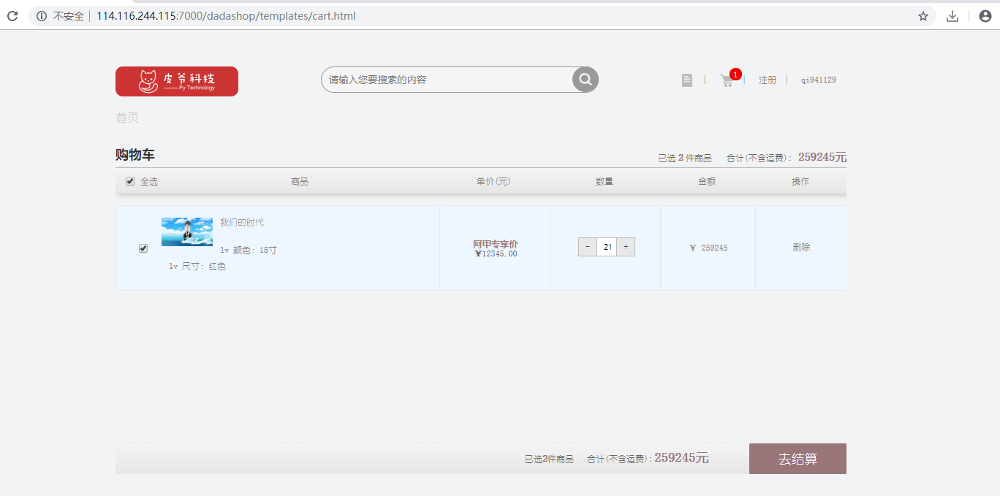


**URL**： 127.0.0.1:8000/v1/carts/<username> 

**请求方式**：DELETE

**请求参数**

```python
#请求参数示例： 
{"sku_id":1001}
```

| 参数   | 类型 | 是否必须 | 说明       |
| ------ | ---- | -------- | ---------- |
| sku_id | int  | 是       | 商品sku_id |

**返回值**：json

**响应格式**：

```python
# 正常响应： 
{'code': 200, 'data': {'carts_count': count}, 'base_url': PIC_URL}

# 异常响应
{"code":xxx,"error"：xxxx}
```


|   字段   |     含义     | 类型 | 备注                        |
| :------: | :----------: | :--: | --------------------------- |
|   code   |    状态码    | int  | 默认正常为200，异常见状态码 |
|   data   |   具体数据   | dict | 与error二选一               |
|  error   |   错误信息   | char | 与data二选一                |
| base_url | 图片存储路径 | char | 成功返回图片存储路径        |

```
base_url 例子
http://127.0.0.1:8000/media/
```


data参数信息

| 参数        | 类型 | 是否必须 | 说明             |
| ----------- | ---- | -------- | ---------------- |
| carts_count | int  | 是       | 购物车里数量长度 |


状态码参考

| 状态码 | 响应信息   | 原因短句         |
| ------ | ---------- | ---------------- |
| 200    | 正常       | OK               |
| 30101  | 未找到商品 | SKU query error  |
| 30104  | 未找到用户 | User query error |


### 4.购物车页面商品数量增加

#### 事件触发:

页面名：**cart.html** 

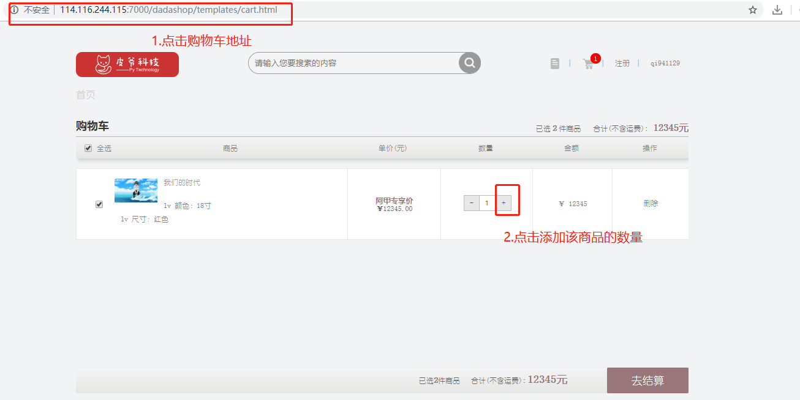

#### 触发结果:

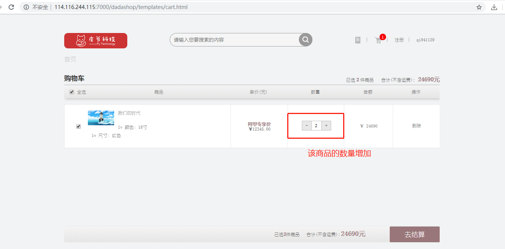


**URL**： 127.0.0.1:8000/v1/carts/<username> 

**请求方式**：PUT

**请求参数**：JSON

| 参数   | 类型 | 是否必须 | 说明         |
| ------ | ---- | -------- | ------------ |
| sku_id | int  | 是       | 商品sku_id   |
| count  | int  | 是       | 单个商品数量 |
| state  | str  | 是       | 判断事件状态 |

```python
#请求示例 
{'sku_id':1001,count:1,state:'add'}
```

**返回值**：JSON

**响应格式**：

```python
# 正常响应： 
{'code': 200, 'data': skus_list, 'base_url': PIC_URL}

# 异常响应
{"code":xxx,"error"：xxxx}
```


|   字段   |     含义     | 类型 | 备注                        |
| :------: | :----------: | :--: | --------------------------- |
|   code   |    状态码    | int  | 默认正常为200，异常见状态码 |
|   data   |   具体数据   | dict | 与error二选一               |
|  error   |   错误信息   | char | 与data二选一                |
| base_url | 图片存储路径 | char | 成功返回图片存储路径        |

```
base_url 例子
http://127.0.0.1:8000/media/
```


skus_list参数信息

| 参数               | 类型    | 是否必须 | 说明                             |
| ------------------ | ------- | -------- | -------------------------------- |
| id                 | int     | 是       | 商品sku_id                       |
| name               | str     | 是       | 商品名称                         |
| count              | int     | 是       | 单个商品数量                     |
| default_image_url  | str     | 是       | 商品默认图片路径                 |
| price              | decimal | 是       | 商品单价                         |
| sku_sale_attr_name | list    | 是       | 商品属性                         |
| sku_sale_attr_val  | list    | 是       | 商品属性值                       |
| selected           | int     | 是       | 商品的选中状态（0未选中，1选中） |

```python
#skus_list中数据示例 [{"id":"","name":"","count":"","selected":"","default_image_url":"","price":"","sku_sale_attr_na me":[],"sku_sale_attr_val":[]},{"":""...}]

#注：
sku_sale_attr_name = ["尺寸"，"颜色"]
sku_sale_attr_val = ["18寸","蓝色"]
```

状态码参考

| 状态码 | 响应信息   | 原因短语         |
| ------ | ---------- | ---------------- |
| 200    | 正常       | OK               |
| 30101  | 未找到商品 | SKU query error  |
| 30104  | 未找到用户 | User query error |


### 5.购物车页面商品数量减少

#### 事件触发

页面名：**cart.html** 

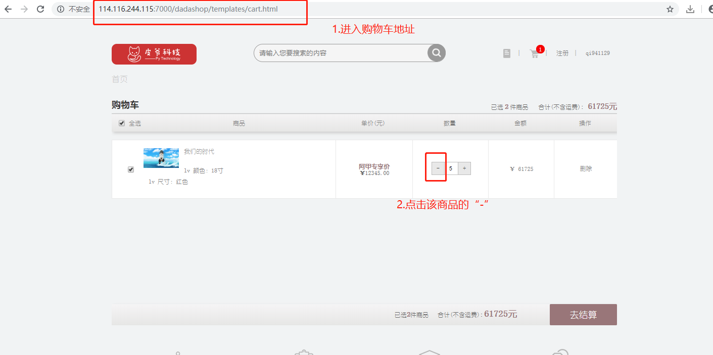

#### 触发结果

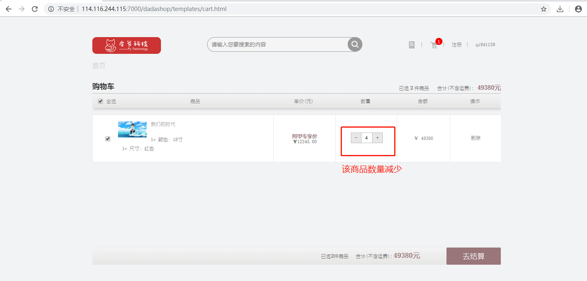


**URL**： 127.0.0.1:8000/v1/carts/<username> 

**请求方式**: PUT

**请求参数**：JSON

| 参数   | 类型 | 是否必须 | 说明         |
| ------ | ---- | -------- | ------------ |
| sku_id | int  | 是       | 商品的sku_id |
| count  | int  | 是       | 单个商品数量 |
| state  | str  | 是       | 判断事件状态 |

```python
#请求示例： 
{'sku_id':1001,count:1,state:'del'}
```

**返回值**：JSON

**响应格式**：

```
# 正常响应： 
{'code': 200, 'data': skus_list, 'base_url': PIC_URL}

# 异常响应
{"code":xxx,"error"：xxxx}
```

|   字段   |     含义     | 类型 | 备注                        |
| :------: | :----------: | :--: | --------------------------- |
|   code   |    状态码    | int  | 默认正常为200，异常见状态码 |
|   data   |   具体数据   | dict | 与error二选一               |
|  error   |   错误信息   | char | 与data二选一                |
| base_url | 图片存储路径 | char | 成功返回图片存储路径        |

```
base_url 例子
http://127.0.0.1:8000/media/
```


skus_list参数信息

| 参数               | 类型    | 是否必须 | 说明                             |
| ------------------ | ------- | -------- | -------------------------------- |
| id                 | int     | 是       | 商品sku_id                       |
| name               | str     | 是       | 商品名称                         |
| count              | int     | 是       | 单个商品数量                     |
| default_image_url  | str     | 是       | 商品默认图片路径                 |
| price              | decimal | 是       | 商品单价                         |
| sku_sale_attr_name | list    | 是       | 商品属性                         |
| sku_sale_attr_val  | list    | 是       | 商品属性值                       |
| selected           | int     | 是       | 商品的选中类型（0未选中，1选中） |

```python
#skus_list中数据示例 [{"id":"","name":"","count":"","selected":"","default_image_url":"","price":"","sku_sale_attr_na me":[],"sku_sale_attr_val":[]},{"":""...}]

#注：
sku_sale_attr_name = ["尺寸"，"颜色"]
sku_sale_attr_val = ["18寸","蓝色"]
```

状态码参数

| 状态码 | 响应信息   | 原因短语         |
| ------ | ---------- | ---------------- |
| 200    | 正常       | OK               |
| 30101  | 未找到商品 | SKU query error  |
| 30104  | 未找到用户 | User query error |


### 6.购物车商品单选

#### 事件触发

页面名：**cart.html** 

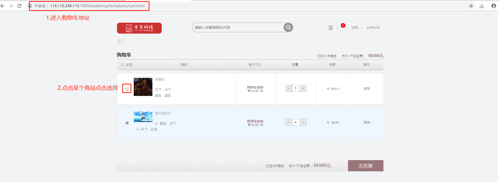

#### 触发结果

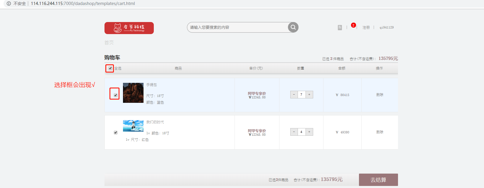


**URL**： 127.0.0.1:8000/v1/carts/<username>

**请求方式:** PUT

**请求参数**：JSON

| 参数   | 类型 | 是否必须 | 说明                   |
| ------ | ---- | -------- | ---------------------- |
| sku_id | int  | 是       | 购物车显示商品的sku_id |
| state  | str  | 是       | 判断事件状态           |

```python
#请求示例 
{'sku_id':1001,state:'select'}
```

**返回值**：JSON

**响应格式**

```python
# 正常响应： 
{'code': 200, 'data': skus_list, 'base_url': PIC_URL}

# 异常响应
{"code":xxx,"error"：xxxx}
```


|   字段   |     含义     | 类型 | 备注                        |
| :------: | :----------: | :--: | --------------------------- |
|   code   |    状态码    | int  | 默认正常为200，异常见状态码 |
|   data   |   具体数据   | dict | 与error二选一               |
|  error   |   错误信息   | char | 与data二选一                |
| base_url | 图片存储路径 | char | 成功返回图片存储路径        |

```
base_url 例子
http://127.0.0.1:8000/media/
```


skus_list参数信息

| 参数               | 类型    | 是否必须 | 说明                             |
| ------------------ | ------- | -------- | -------------------------------- |
| id                 | int     | 是       | 商品sku_id                       |
| name               | str     | 是       | 商品名称                         |
| count              | int     | 是       | 单个商品数量                     |
| default_image_url  | str     | 是       | 商品默认图片路径                 |
| price              | decimal | 是       | 商品单价                         |
| sku_sale_attr_name | list    | 是       | 商品属性                         |
| sku_sale_attr_val  | list    | 是       | 商品属性值                       |
| selected           | int     | 是       | 商品的选中状态（0未选中，1选中） |

```python
#skus_list中数据示例 [{"id":"","name":"","count":"","selected":"","default_image_url":"","price":"","sku_sale_attr_na me":[],"sku_sale_attr_val":[]},{"":""...}]

#注：
sku_sale_attr_name = ["尺寸"，"颜色"]
sku_sale_attr_val = ["18寸","蓝色"]
```

状态码参考

| 状态码 | 响应信息   | 原因短语         |
| ------ | ---------- | ---------------- |
| 200    | 正常       | OK               |
| 30101  | 未找到商品 | SKU query error  |
| 30104  | 未找到用户 | User query error |


### 7.购物车商品取消单选

#### 事件触发

页面名：**cart.html** 

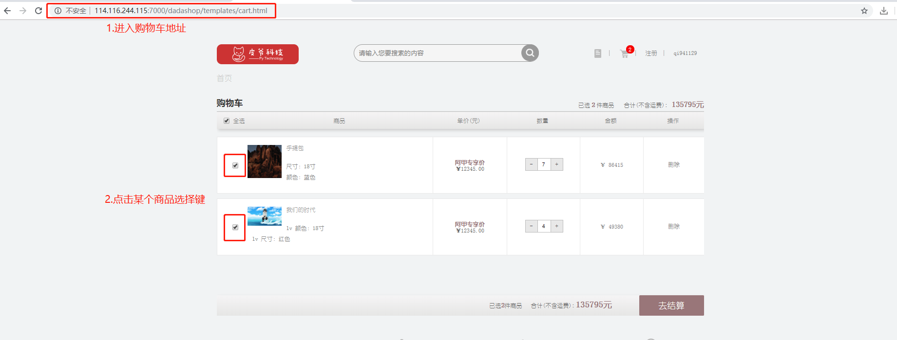

#### 触发结果

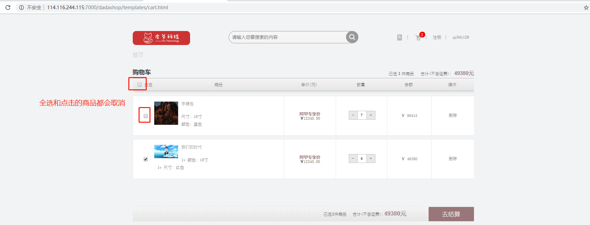


**URL**： 127.0.0.1:8000/v1/carts/<username>

**请求方式**: PUT

**请求参数**：JSON

| 参数   | 类型 | 是否必须 | 说明                   |
| ------ | ---- | -------- | ---------------------- |
| state  | str  | 是       | 判断事件状态           |
| sku_id | int  | 是       | 购物车显示商品的sku_id |

```python
#请求示例 
{'sku_id':1001,state:'unselect'}
```

**返回值**:JSON

**响应格式**:

```python
# 正常响应： 
{'code': 200, 'data': skus_list, 'base_url': PIC_URL}

# 异常响应
{"code":xxx,"error"：xxxx}
```


|   字段   |     含义     | 类型 | 备注                        |
| :------: | :----------: | :--: | --------------------------- |
|   code   |    状态码    | int  | 默认正常为200，异常见状态码 |
|   data   |   具体数据   | dict | 与error二选一               |
|  error   |   错误信息   | char | 与data二选一                |
| base_url | 图片存储路径 | char | 成功返回图片存储路径        |

```
base_url 例子
http://127.0.0.1:8000/media/
```


skus_list参数信息

| 参数               | 类型    | 是否必须 | 说明                             |
| ------------------ | ------- | -------- | -------------------------------- |
| id                 | int     | 是       | 商品sku_id                       |
| name               | str     | 是       | 商品名称                         |
| count              | int     | 是       | 单个商品数量                     |
| default_image_url  | str     | 是       | 商品默认图片路径                 |
| price              | decimal | 是       | 商品单价                         |
| sku_sale_attr_name | list    | 是       | 商品属性                         |
| sku_sale_attr_val  | list    | 是       | 商品属性值                       |
| selected           | int     | 是       | 商品的选中状态（0未选中，1选中） |

```python
#skus_list中数据示例 [{"id":"","name":"","count":"","selected":"","default_image_url":"","price":"","sku_sale_attr_na me":[],"sku_sale_attr_val":[]},{"":""...}]

#注：
sku_sale_attr_name = ["尺寸"，"颜色"]
sku_sale_attr_val = ["18寸","蓝色"]
```

状态码参考

| 状态码 | 响应信息   | 原因短语         |
| ------ | ---------- | ---------------- |
| 200    | 正常       | OK               |
| 30101  | 未找到商品 | SKU query error  |
| 30104  | 未找到用户 | User query error |


### 8.购物车商品全选

#### 事件触发

页面名：**cart.html** 

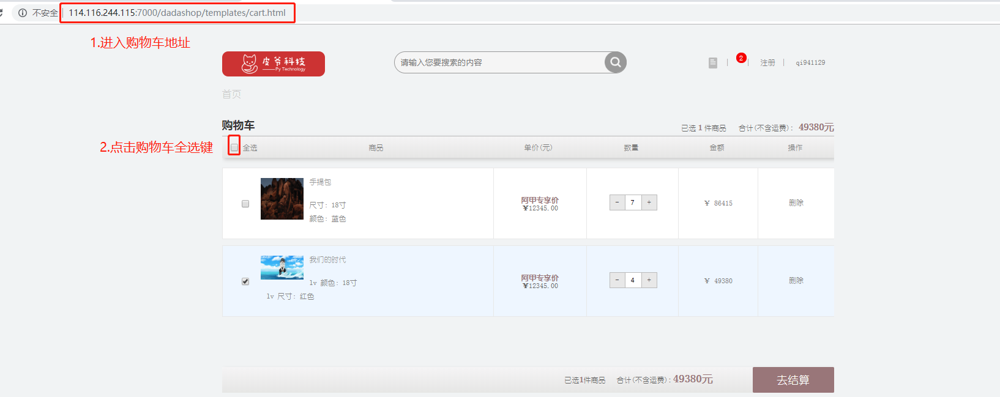

#### 触发结果

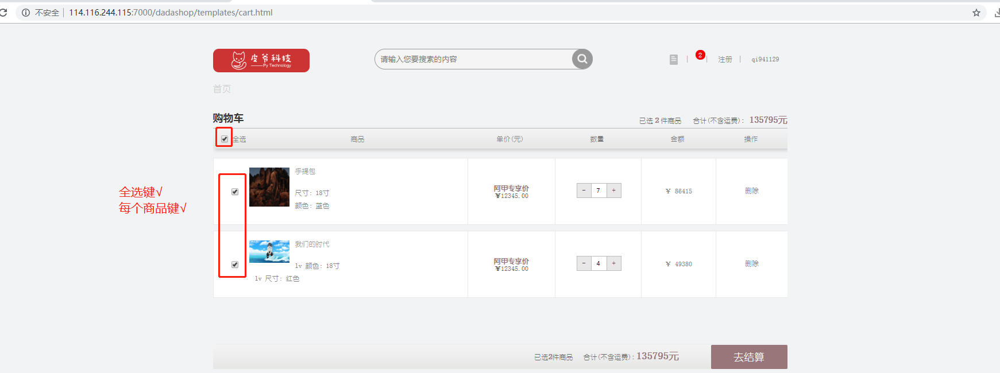


**URL**： 127.0.0.1:8000/v1/carts/<username>

**请求方式:** PUT

**请求参数**：JSON

| 参数  | 类型 | 是否必须 | 说明         |
| ----- | ---- | -------- | ------------ |
| state | str  | 是       | 判断事件状态 |

```
#请求示例： 
{state:'selectall'}
```

**返回值**：JSON

**响应格式**

```python
# 正常响应： 
{'code': 200, 'data': skus_list, 'base_url': PIC_URL}

# 异常响应
{"code":xxx,"error"：xxxx}
```

|   字段   |     含义     | 类型 | 备注                        |
| :------: | :----------: | :--: | --------------------------- |
|   code   |    状态码    | int  | 默认正常为200，异常见状态码 |
|   data   |   具体数据   | dict | 与error二选一               |
|  error   |   错误信息   | char | 与data二选一                |
| base_url | 图片存储路径 | char | 成功返回图片存储路径        |

```
base_url 例子
http://127.0.0.1:8000/media/
```

skus_list参数信息

| 参数               | 类型    | 是否必须 | 说明                             |
| ------------------ | ------- | -------- | -------------------------------- |
| id                 | int     | 是       | 商品sku_id                       |
| name               | str     | 是       | 商品名称                         |
| cart_count         | int     | 是       | 单个商品数量                     |
| default_image_url  | str     | 是       | 商品默认图片路径                 |
| price              | decimal | 是       | 商品单价                         |
| sku_sale_attr_name | list    | 是       | 商品属性                         |
| sku_sale_attr_val  | list    | 是       | 商品属性值                       |
| selected           | int     | 是       | 商品的选中状态（0未选中，1选中） |

```python
#skus_list中数据示例 [{"id":"","name":"","count":"","selected":"","default_image_url":"","price":"","sku_sale_attr_na me":[],"sku_sale_attr_val":[]},{"":""...}]

#注：
sku_sale_attr_name = ["尺寸"，"颜色"]
sku_sale_attr_val = ["18寸","蓝色"]
```

状态码参考

| 状态码 | 响应信息   | 原因短句         |
| ------ | ---------- | ---------------- |
| 200    | 正常       | OK               |
| 30104  | 未找到用户 | User query error |


### 9 购物车商品取消全选

#### 事件触发

页面名：**cart.html** 

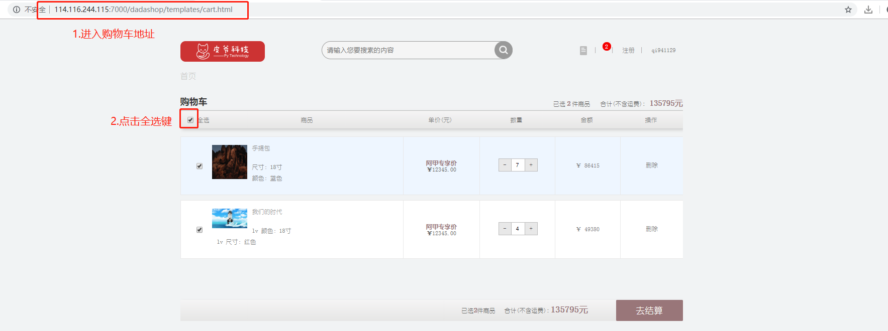

#### 触发结果

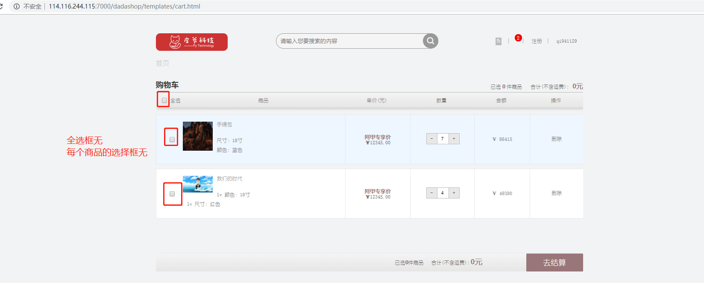


**URL**： 127.0.0.1:8000/v1/carts/<username>

**请求方式**: PUT

**请求参数**：JSON

| 参数  | 类型 | 是否必须 | 说明         |
| ----- | ---- | -------- | ------------ |
| state | str  | 是       | 判断事件状态 |

```
#请求示例 
{state:'unselectall'}
```

**返回值**：JSON

**响应格式**：

```python
# 正常响应： 
{'code': 200, 'data': skus_list, 'base_url': PIC_URL}

# 异常响应
{"code":xxx,"error"：xxxx}
```


|   字段   |     含义     | 类型 | 备注                        |
| :------: | :----------: | :--: | --------------------------- |
|   code   |    状态码    | int  | 默认正常为200，异常见状态码 |
|   data   |   具体数据   | dict | 与error二选一               |
|  error   |   错误信息   | char | 与data二选一                |
| base_url | 图片存储路径 | char | 成功返回图片存储路径        |

```
base_url 例子
http://127.0.0.1:8000/media/
```


skus_list参数信息

| 参数               | 类型    | 是否必须 | 说明                            |
| ------------------ | ------- | -------- | ------------------------------- |
| id                 | int     | 是       | 商品sku_id                      |
| name               | str     | 是       | 商品名称                        |
| count              | int     | 是       | 单个商品数量                    |
| default_image_url  | str     | 是       | 商品默认图片路径                |
| price              | decimal | 是       | 商品单价                        |
| sku_sale_attr_name | list    | 是       | 商品属性                        |
| sku_sale_attr_val  | list    | 是       | 商品属性值                      |
| selected           | int     | 是       | 商品的选中状态（0未选中,1选中） |

```python
#skus_list中数据示例 [{"id":"","name":"","count":"","selected":"","default_image_url":"","price":"","sku_sale_attr_na me":[],"sku_sale_attr_val":[]},{"":""...}]

#注：
sku_sale_attr_name = ["尺寸"，"颜色"]
sku_sale_attr_val = ["18寸","蓝色"]
```

状态码参考

| 状态码 | 响应信息   | 原因短语         |
| ------ | ---------- | ---------------- |
| 200    | 正常       | OK               |
| 30104  | 未找到用户 | User query error |


### 10.合并购物车

登陆模块会调用合并购物车函数

#### 触发事件

页面名：**cart.html** 

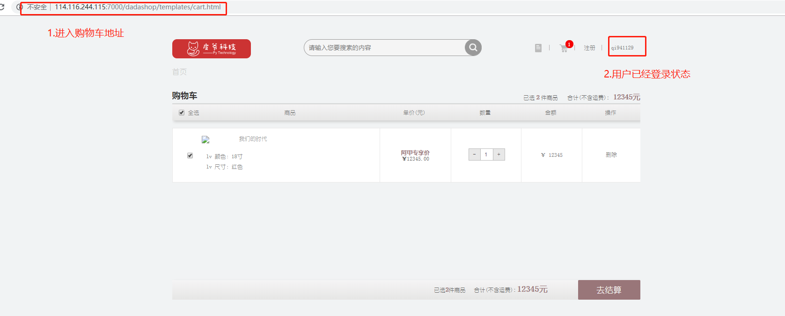

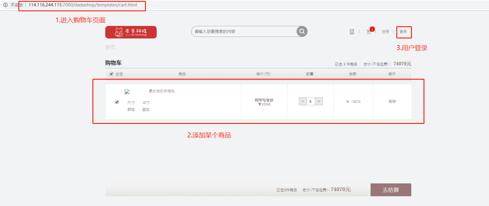

#### 触发结果

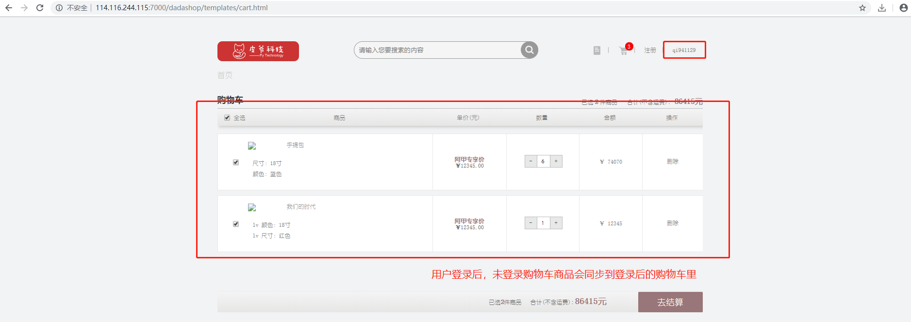


**请求参数**：JSON

| 参数  | 类型 | 是否必须 | 说明         |
| ----- | ---- | -------- | ------------ |
| carts | int  | 是       | 单个商品信息 |

carts参数信息

| 参数               | 类型    | 是否必须 | 说明                            |
| ------------------ | ------- | -------- | ------------------------------- |
| id                 | int     | 是       | 商品sku_id                      |
| name               | str     | 是       | 商品名称                        |
| count              | int     | 是       | 单个商品数量                    |
| default_image_url  | str     | 是       | 商品默认图片路径                |
| price              | decimal | 是       | 商品单价                        |
| sku_sale_attr_name | list    | 是       | 商品属性                        |
| sku_sale_attr_val  | list    | 是       | 商品属性值                      |
| selected           | int     | 是       | 商品的选中状态（0未选中,1选中） |

carts示例

```
"carts":[{"id":"2","count":"8","name":"红色大尺寸","default_image_url":"3_JGA6F97.jpg","price":10000,"selected":true,"sku_sale_attr_name":["安踏A/尺寸：","安踏A/颜色："],"sku_sale_attr_val":["18寸","绿色"]}]

```


**响应格式**：

```json
原登陆响应中添加  carts_count：x
```


| 字段        | 含义         | 类型 | 备注 |
| ----------- | ------------ | ---- | ---- |
| carts_count | 购物车里数量 | int  | 必选 |


状态码参考

| 状态码 | 响应信息 | 原因短语 |
| ------ | -------- | -------- |
| 200    | 正常     | OK       |


