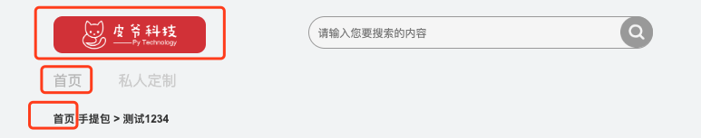
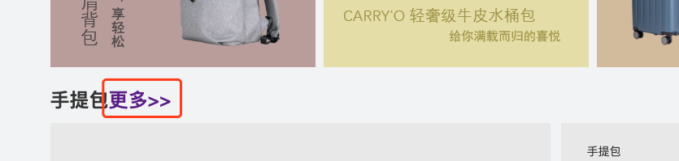
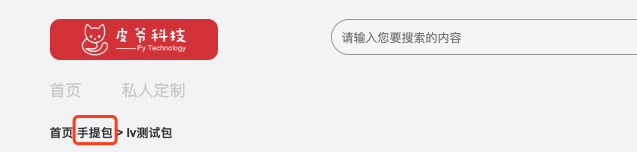
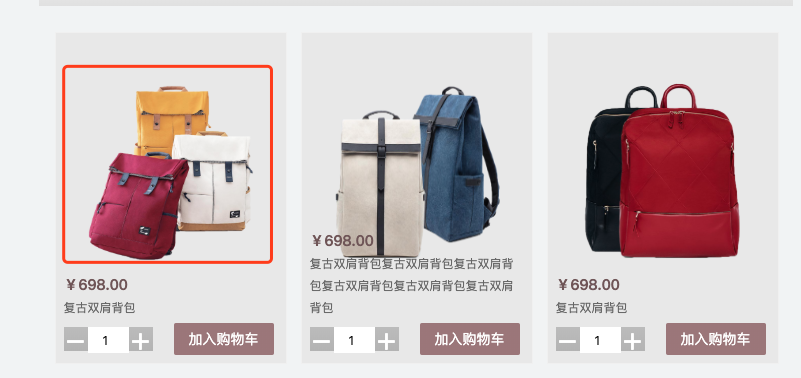
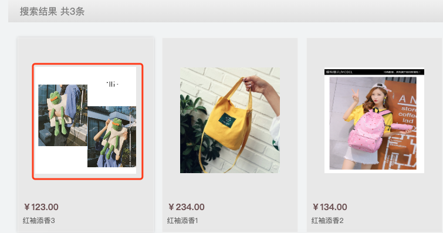
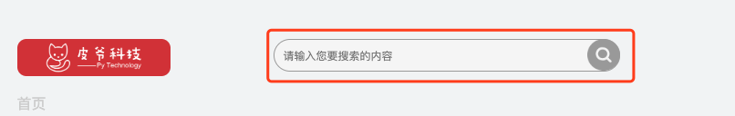
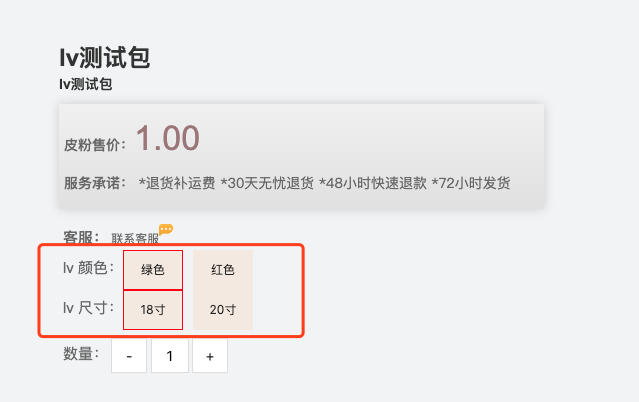

# 商品模块-接口说明

## 一. 商品模块概述：

##### 商品模块是整个电商项目的核心部分，各个模块都是围绕商品模块展开，主要分为以下几个功能(还在不断拓展中)：

1. 商品首页展示 
2. 商品品类页展示
3. 商品详情页展示
4. 商品首页搜索以及搜索页展示
5. 商品详情页 sku 切换


## 二. 事件定义

### 商品首页展示

**数据展示部分**：在商城首页的下半部为商品部分展示，在首页展示的效果为每个品类下展示三个该品类的商品，即三个分类下的 sku，如果每个类别下的sku不足三个会报错，这一点需注意。

**缓存管理部分**：在首页展示部分还添加了缓存数据管理的部分，用到了 redis 数据库。


### 商品品类页展示

**数据展示部分**：根据商品的不同分类进行相应的展示，具有分页展示的功能，是根据类别 id 进行的分类筛选。


### 商品详情页展示

**数据展示部分**：为确定到某一个 sku 需要在商品详情页选择相关的一组销售属性以及该组销售属性所对应的一组销售属性值来确定库存项。再次强调，最终购买的商品是一个具体的 sku 对象所代表的商品，而不是一个模棱两可的概念，比如 iphone 11 并不能直接去购买，而可以去购买的可能是 iphone 11 墨绿色 64G 这个特定的 sku。

**SKU 切换**：在该功能中还有切换 sku 的功能部分，在详情页展示接口中会传入该 sku 所属的 spu 的 id，通过 spu_id 可获取到 spu 下的 sku 列表，之后通过销售属性值进行 sku 筛选，将筛选的 sku id 返回给前端。     

**详情页缓存管理**：在详情页展示部分还添加了缓存数据管理的部分，用到了 redis 数据库。


### 商品首页搜索

**搜索功能**：商品的首页搜索功能是通过 elasticsearch 搜索引擎对指定的字段添加索引之后进行搜索。在搜索的结果列表页页添加了分页的功能。具体到 elasticsearch 如何使用请参考 ***Elasticsearch文档.pdf*** 。


### 详情页 SKU 切换

在详情页展示接口中会传入该 sku 所属的 spu 的 id，通过 spu_id 可获取到 spu 下的 sku 列表，之后通过销售属性值进行 sku 筛选，将筛选的 sku id 返回给前端。  


## 三. API说明

### 1. 首页商品展示

**URL：**`http://127.0.0.1:8000/v1/goods/index`

**接口定位**：

​    1. 商城首页


​	2. 商品详情页，列表页以及搜索结果页




**前端代码**：

```javascript
$.ajax({
  type : 'get',
  url : baseUrl+'/v1/goods/index',
  success:function (response) {
    var data = response.data
    // const BASE_URL = '../static/media/'
    if (response.code==200) {
      var html = ''
      var IMG_URL = response.base_url
      for (var i=0;i<data.length;i++){
        html+= '<div class="study">'
        html+= '<p>'+data[i].catalog_name+'<a href='+"product_list.html?catalog_id="+data[i].catalog_id+' class="product_more">更多>></a></p>'
        var sku = data[i].sku
        console.log("sku2: " + sku[2])

        html += '<div class="study_left lf">'
        html+='<div class="product_parameters_main">'
        html+='<p>'+sku[0].name+'</p>'
        html+='<h3 class="product_name_main">'+sku[0].caption+'</h3>'
        html+='<h3 class="product_preferential_main">限时特惠<b class="product_price_main">'+sku[0].price+'</b></h3>\n'
        html+='<p class="view_details"><a href='+"product_details.html?skuid="+sku[0].skuid+'>查看详情</a></p>'
        html+='</div>'
        html+=''
        html+='</div>'
        html+='<div class="study_right rt"><div class="right_top"><div class="product_parameters_vice1">'
        html+='<h3 class="product_name_vice1">'+sku[1].name+'</h3>'
        html+='<h3 class="product_preferential_vice1"><b class="product_price_vice1">'+sku[1].price+'</b></h3>'
        html+='<p class="view_details"><a href='+"product_details.html?skuid="+sku[1].skuid+'>查看详情</a></p></div>'
        html+='</div>'
        html+='<div class="right_bottom"><div class="product_parameters_vice2">'
        html+='<h3 class="product_name_vice2">'+sku[2].name+'</h3>'
        html+='<h3 class="product_preferential_vice2"><b class="product_price_vice2">'+sku[2].price+'</b></h3>'
        html+='<p class="view_details"><a href='+"product_details.html?skuid="+sku[2].skuid+'>查看详情</a></p>'
        html+=''
        html+='</div></div></div>'
        html+='</div>'
      }
      $('#content').html(html)
    }
  },
  error:function(err){
    console.log(err)
  }
})
```


**请求方式**：GET

**返回值：**JSON

| 字段                             | 含义                         | 类型 | 备注          |
| -------------------------------- | ---------------------------- | ---- | ------------- |
| code                             | 状态                         | int  | 默认正常为200 |
| data(以下数据均为data下的子数据) | 返回具体的数据都包含在data中 | {}   |               |
| catalog_id                       | 品类id                       | int  |               |
| catalog_name                     | 品类名称                     | str  |               |
| sku                              | 该列表下为商品具体数据       |      |               |
| skuid                            | skuid                        | int  |               |
| name                             | sku商品标题                  | str  |               |
| caption                          | sku副标题                    | str  |               |
| price                            | sku价格                      | str  |               |
| image                            | sku图片                      | str  |               |
| base_url                         | 图片 base_url                | str  |               |

**响应格式**：

```python
# 响应
{
    "code": 200,
    "data": [
        {
            "catalog_id": 1,
            "catalog_name": "手提包",
            "sku": [
                {
                    "skuid": 1,
                    "caption": "测试1",
                    "name": "测试1234",
                    "price": "2.00",
                    "image": "v2-b01fad0ef311933a6308c14b2a00a35e_r.jpg"
                },
                {
                    "skuid": 2,
                    "caption": "测试2",
                    "name": "测试2",
                    "price": "1.00",
                    "image": "1_lxYxmFz.jpg"
                },
                {
                    "skuid": 3,
                    "caption": "测试3",
                    "name": "测试3",
                    "price": "1.00",
                    "image": "v2-b01fad0ef311933a6308c14b2a00a35e_r_fG82hdD.jpg"
                }
            ]
        }
    ],
    "base_url": "http://127.0.0.1:8000/media/"
}
```

**状态码参考**：

| 状态码 | 响应信息 | 原因短语 |
| ------ | -------- | -------- |
| 200    | 正常     | OK       |


### 2. 获取商品品类页接口

**URL：**`http://127.0.0.1:8000/v1/goods/catalogs/<catalog_id>`

**接口定位：**

1. 首页展示

   

2. 详情展示页

   


**前端代码**：

```javascript
$(function () {
      var catalog_id = $.getUrlParam('catalog_id')[2]
      const BASE_URL = '../static/media/'
      window.localStorage.setItem('catalog_id',catalog_id)
      window.localStorage.setItem('canload',true)
      if (window.localStorage.canload){
        $.ajax({
        type: "get",
        url:baseUrl+'/v1/goods/catalogs'+catalog_id+'?launched=true&page=1',
        success: function (result) {
          if (result.code==200){
            var IMG_URL = result.base_url
            var html = ''
            var pages = Math.ceil(result.paginator.total / result.paginator.pagesize)
            window.localStorage.setItem('pageMax',pages)
            html += '<a href="javascript:;" class="current">1</a>'
            for (var j=2;j<=pages;j++){
              html += '<a href="javascript:;" class="tcdNumber">'+j+'</a>'
            }
            $('#btnBox').html(html);

            var list = ''
            result.data.forEach(el => {
              list += '<div class="product" id="' + el.skuid +
                '"><a href='+"product_details.html?skuid="+el.skuid+'>'
              list += '</a>'
              list += '<div class="addRemoveProduct">'
              list += '<p>'
              list += '<span class="price">￥' + el.price + '</span>'
              list += '<a href='+"product_details.html?skuid="+el.skuid+' class="title" title='+el.name+'>'+el.name+'</a></p></div></div>'
            });
            $('.salc_content').html(list)
            window.localStorage.setItem('canload',false)

          }
        },

        error: function (data) {
          console.log(data)
        }
     })
      }
    }
```


**请求方式:** GET

**请求参数：**

**URL：**`http://127.0.0.1:8000/v1/goods/catalogs/<catalog_id>?launched=true&page=1&pagesize=9`

| 字段     | 含义                 | 类型 | 备注       |
| -------- | -------------------- | ---- | ---------- |
| launched | 该sku是否上线        | str  | 默认为true |
| page     | 分页项的当前页参数   | int  |            |
| pagesize | 每页所展示数据的数量 | int  |            |

**返回值：**JSON

**响应格式**：

```python
#响应示例：
{
    "code": 200,
    "data": [
        {
            "skuid": 1,
            "name": "测试1",
            "price": "2.00",
            "image": "v2-b01fad0ef311933a6308c14b2a00a35e_r.jpg"
        },
        {
            "skuid": 2,
            "name": "测试2",
            "price": "1.00",
            "image": "1_lxYxmFz.jpg"
        },
        {
            "skuid": 3,
            "name": "测试3",
            "price": "1.00",
            "image": "v2-b01fad0ef311933a6308c14b2a00a35e_r_fG82hdD.jpg"
        },
        {
            "skuid": 4,
            "name": "测试4",
            "price": "1.00",
            "image": "v2-b01fad0ef311933a6308c14b2a00a35e_r_7D60joF.jpg"
        },
        {
            "skuid": 5,
            "name": "测试5",
            "price": "1.00",
            "image": "dl.jpeg"
        },
        {
            "skuid": 6,
            "name": "测试6",
            "price": "1.00",
            "image": "v2-b01fad0ef311933a6308c14b2a00a35e_r_9vdsRzK.jpg"
        },
        {
            "skuid": 7,
            "name": "测试7",
            "price": "1.00",
            "image": "1_bNbqu9f.jpg"
        },
        {
            "skuid": 8,
            "name": "测试8",
            "price": "1.50",
            "image": "1_NHrTbfx.jpg"
        },
        {
            "skuid": 9,
            "name": "测试9",
            "price": "1.00",
            "image": "v2-b01fad0ef311933a6308c14b2a00a35e_r_2nbsI3S.jpg"
        }
    ],
    "paginator": {
        "pagesize": 9,
        "total": 10
    },
    "base_url": "http://127.0.0.1:8000/media/"
}
```

| 字段     | 含义       | 类型 | 备注                        |
| -------- | ---------- | ---- | --------------------------- |
| code     | 状态码     | int  | 默认正常为200，异常见状态码 |
| data     | 具体数据   | dict | 与error二选一               |
| error    | 错误信息   | char | 与data二选一                |
| base_url | 图片根路径 | str  |                             |

**data参数信息**

| 参数  | 类型 | 是否必须 |       说明       |
| :---: | :--: | :------: | :--------------: |
| skuid | int  |    是    |    商品sku_id    |
| name  | str  |    是    |     商品名称     |
| price | int  |    是    |     商品价格     |
| image | str  |    是    | 商品默认图片路径 |

**状态码参考**

| 状态码 | 响应信息                      | 原因短语                      |
| ------ | ----------------------------- | ----------------------------- |
| 200    | 正常                          | OK                            |
| 40200  | 页数有误，小于0或者大于总页数 | 页数有误，小于0或者大于总页数 |


### 3. 商品详情页展示

**URL：**`127.0.0.1:8000/v1/goods/detail/<sku_id>`

**接口定位**：

1. 首页展示

   

2. 商品列表页

   

3. 搜索结果页

   


**前段代码：**

```javascript
$.ajax({
  type: 'get',
  url: baseUrl+'/v1/goods/detail/'+skuid,
  success: function (result) {
    var IMG_URL = result.base_url
    $('#nav_detail').html(
      '<h5><a href="index.html">首页</a>  <a href="product_list.html?catalog_id=' +
      result.data.catalog_id + '">' + result.data.catalog_name + '</a>' +
      '  >  ' + result.data.name);
    $('#mImg').attr('src', IMG_URL+result.data.image);
    $('.right_detail').children('h1').html(result.data.name);
    $('.right_detail').children('h3').html(result.data.caption);
    $('#pro_price').children('span').html(result.data.price);
    ......
```


**请求方式**：GET

**返回值**：JSON

**响应格式：**

```python
#响应示例
{
    "code": 200,
    "data": {
        "image": "WX20191122-162341.png",
        "spu": 2,
        "name": "手提包",
        "caption": "最时尚的手提包",
        "price": "12345.00",
        "catalog_id": 1,
        "catalog_name": "手提包",
        "detail_image": "v2-b01fad0ef311933a6308c14b2a00a35e_r_9e6LDGO.jpg",
        "sku_sale_attr_id": [
            7,
            8
        ],
        "sku_sale_attr_names": [
            "尺寸",
            "颜色"
        ],
        "sku_sale_attr_val_id": [
            11,
            13
        ],
        "sku_sale_attr_val_names": [
            "18寸",
            "蓝色"
        ],
        "sku_all_sale_attr_vals_id": {
            "7": [
                11,
                12
            ],
            "8": [
                13,
                14
            ]
        },
        "sku_all_sale_attr_vals_name": {
            "7": [
                "18寸",
                "15寸"
            ],
            "8": [
                "蓝色",
                "绿色"
            ]
        },
        "spec": {
            "批次": "2000",
            "数量": "2000",
            "年份": "2000"
        }
    },
    "base_url": "http://127.0.0.1:8000/media/"
}
```

| 字段                        | 含义                               | 类型 | 备注           |
| --------------------------- | ---------------------------------- | ---- | -------------- |
| code                        | 状态                               | Int  | 正常为200      |
| data                        | 返回的具体数据均在data里           | {}   | 数据格式见上图 |
| image                       | sku图片                            | str  |                |
| spu                         | 该sku所对应的spu                   | int  |                |
| name                        | sku正标题                          | str  |                |
| caption                     | sku副标题                          | str  |                |
| price                       | sku销售价                          | str  |                |
| catalog_id                  | 类别id                             | int  |                |
| catalog_name                | 类别名称                           | str  |                |
| detail_image                | 详情页大图                         | str  |                |
| spec                        | 商品规格以及规格值                 | dict |                |
| sku_sale_attr_id            | 该sku所具备的销售属性id            | list |                |
| sku_sale_attr_names         | 该sku所具备的销售属性名称          | list |                |
| sku_sale_attr_val_id        | sku销售属性值id                    | list |                |
| sku_sale_attr_val_name      | sku销售属性值名称                  | list |                |
| sku_all_sale_attr_vals_id   | 每个销售所对应的所有销售属性值id   | dict |                |
| sku_all_sale_attr_vals_name | 每个销售所对应的所有销售属性值名称 | dict |                |
| base_url                    | 图片路径                           | str  |                |


**状态码参考**

| 状态码 | 响应信息     | 原因短语              |
| ------ | ------------ | --------------------- |
| 200    | 正常         | OK                    |
| 40201  | sku_id不存在 | Such sku doesn' exist |


### 四，商品首页搜索

**URL：**`127.0.0.1:8000/v1/goods/search`

**接口定位：**

 1. 首页展示页

    


**前端代码：**

```javascript
const SEARCHURL = SEARCHHOST + '/v1/goods/search';
let getQueryString = ( searchKey ) => {
  /**
   * @param  {String} searchKey  [查询Url数据的字段]
   * @return {String} searchData [查询结果]
   */
  let searchData = {};
  let urlData = window.location.href;
  urlData = urlData.split('?');          
  urlData.shift();
  urlData = urlData[0].split('&');
  urlData.forEach( ( item , i , self ) => {
    let urlDataItem = item.split('=');
    searchData[ urlDataItem[0] ] = urlDataItem[1]
  })
  return searchData[ searchKey ];
}

$.ajax({
  type: 'post' ,
  url: SEARCHURL,
  data: {
    q : unescape(searchData.replace(/\\/g, "%")),
  },
  success( data ){          
    if( data.code == 200 ){
      var result = data
      //加载渲染
      if (result.result)
        console.log("pages: " + pages)
      var pages = Math.ceil(result.paginator.total / result.paginator.pagesize);
      window.localStorage.setItem('pageMax',pages);
      var html = '';
      html += '<a href="javascript:;" class="current">1</a>';
      for (var j=2;j<=pages;j++){
        html += '<a href="javascript:;" class="tcdNumber">'+j+'</a>'
      }
      console.log(html)
      $('#btnBox').html(html);

      var list = ''
      result.data.forEach(el => {
        list += '<div class="product" id="' + el.skuid +'"><a href='+"product_details.html?skuid="+el.skuid+'>'
        list += '</a>'
        list += '<div class="addRemoveProduct">'
        list += '<p>'
        list += '<span class="price">￥' + el.price + '</span>'
        list += '<a href='+"product_details.html?skuid="+el.skuid+' class="title" title='+el.name+'>'+el.name+'</a></p></div></div>'
      });

      $('.salc_content').html(list)
      $('.salc_top').html('搜索结果  共'+result.data.length+'条')
    }else{
      console.error( data.msg )
    }
  },
  error( err ){
    console.log( err );
  }
}
```


**请求方式**：POST

**返回值**：JSON

**响应格式：**

```python
#响应示例：
{
    "code": 200,
    "data": [
        {
            "skuid": 2,
            "name": "测试2",
            "price": "1.00",
            "image": "1_lxYxmFz.jpg"
        },
        {
            "skuid": 3,
            "name": "测试3",
            "price": "1.00",
            "image": "v2-b01fad0ef311933a6308c14b2a00a35e_r_fG82hdD.jpg"
        },
        {
            "skuid": 1,
            "name": "测试1234",
            "price": "2.00",
            "image": "v2-b01fad0ef311933a6308c14b2a00a35e_r.jpg"
        }
    ],
    "paginator": {
        "pagesize": 9,
        "total": 3
    },
    "base_url": "http://127.0.0.1:8000/media/"
}
```

| 字段      | 含义                     | 类型 | 备注               |
| --------- | ------------------------ | ---- | ------------------ |
| code      | 状态                     | Int  | 正常为200          |
| data      | 返回的具体数据均在data里 | {}   | 相应格式数据见下图 |
| skuid     | skuid                    | int  |                    |
| name      | sku正标题                | str  |                    |
| price     | sku销售价                | str  |                    |
| image     | sku图片                  | str  |                    |
| paginator | 分页参数                 | {}   |                    |
| pagesize  | 每页显示条目数量         | int  |                    |
| total     | 总计数据量               | int  |                    |
| base_url  | 图片路径                 |      |                    |

**状态码参考**

| 异常码 | 含义      | 备注                          |
| ------ | --------- | ----------------------------- |
| 40200  | 分页有误  | 页数有误，小于0或者大于总页数 |
| 40202  | sku不存在 | 您所查询的商品不存在          |


### 五，详情页 SKU 切换

**URL：**`127.0.0.1:8000/v1/goods/sku`

**接口定位：**

 1. 详情展示页

    


**前端代码：**

```javascript
$.ajax({
  type: "post",
  url:baseUrl+'/v1/goods/sku',
  beforeSend:function (request) {
    request.setRequestHeader("authorization",localStorage.getItem('dashop_token'))
  },
  data: JSON.stringify(data),
  success: function (data) {
    var result = data;
    if (result.code==200) {
      alert('product_details.html?skuid=' + result.data);
      location.href = 'product_details.html?skuid=' + result.data
    }
    else {
      alert(result.error);
      history.go(0)
    }
  },
  error: function (data) {
    alert("系统异常！");
  }
}
```


**请求方式**：POST

**返回值**：JSON

**响应格式：**

```python
#响应示例：
{
    "code": 200,
    "data": 1
}
```

| 字段 | 含义    | 类型 | 备注      |
| :--- | ------- | ---- | --------- |
| code | 状态    | Int  | 正常为200 |
| data | sku的id | int  |           |

**状态码参考**

| 异常码 | 含义      | 备注      |
| ------ | --------- | --------- |
| 200    | 正常      |           |
| 40050  | sku不存在 | sku不存在 |

