# 订单模块API说明文档

## 一、订单模块概述:

此为达达商城订单功能模块API说明文档,此文档对于常规业务逻辑的流程进行分析和针对订单模块的技术点进行分析。订单模块提供以下功能:

>生成【确认订单】页
>
>生成订单并支付
>
>支付订单
>
>查看订单信息
>
>用户确认收货

## 二、事件定义

### 1.生成【确认订单】页

用户在购物车页面点击确认**去结算**按钮，前端跳转到确认订单页(orderconfirm.html)发送Ajax请求(get)到后端，后端从redis中获取**商品信息**和从mysql中获取**用户地址信息**响应给到订单确认页展示。

### 2.生成订单并支付

用户在【确认订单】页面点击**确认并付款**按钮，前端跳转到支付订单页(payment.html)发送Ajax请求(post)到后端，后端生成订单且将**订单编号、订单状态（默认为待支付)、订单金额**等信息响应给前端订单支付页展示。此次请求带回第三方支付的URL。用户在支付订单页点击**确认支付**按钮，前端获取事件使用**window.location**去访问第三方支付**pay_URL**，之后由支付宝提供支付业务。支付完成支付宝重定向到订单支付结果页面，并异步通知到商城后端。双重验证后返回支付结果给前端展示。

### 3.订单查询

用户在页面头部点击**我的订单**图标，前端跳转到**我的订单页**(Myorder.html)发送Ajax请求(get)到后端,后端查询订单数据相应给前端。前端展示依据订单的状态**全部订单、待付款、待发货、待收货、已完成**进行展示数据即**订单编号、订单金额、成交时间和交易状态**。

### 4.确认收货

用户在我的订单页面点击确认收货,前端获取点击事件向后端发送请求(get).后端将订单状态改为已完成。

### 5.订单支付

用户在我的订单页面点击**去支付**按钮，前端跳转到支付订单页(payment.html)发送Ajax请求(post)到后端,后端生成订单且将**订单编号、订单状态（默认为待支付)、订单金额**等信息响应给前端订单支付页展示。此次请求带回第三方支付的URL。

## 三、API说明

### 1.确认订单API

用户在登录情况下才能够点击去结算并跳转到确认订单页.

#### **1.事件触发:**

`点击去结算按钮`

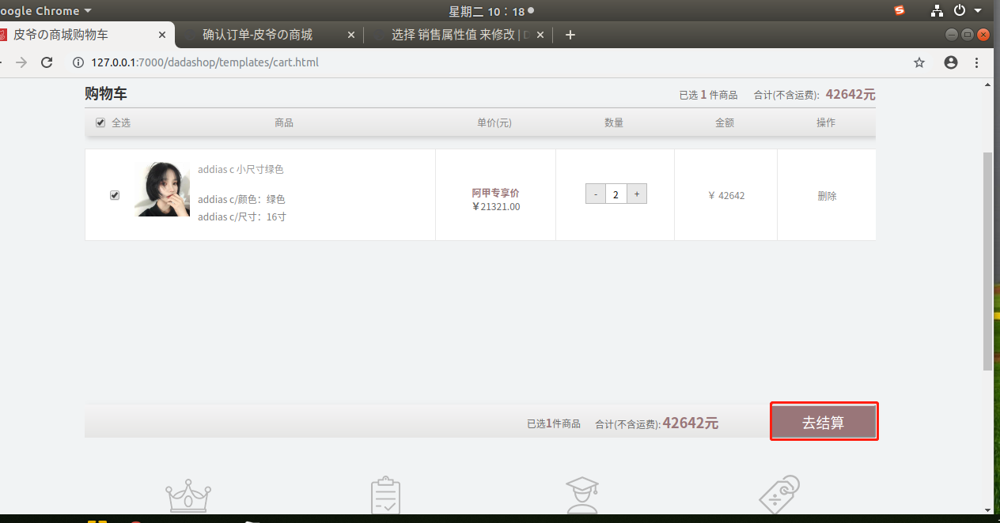


**事件触发(异常):用户无收货地址**

`用户点击去结算按钮`


`点击确定按钮`

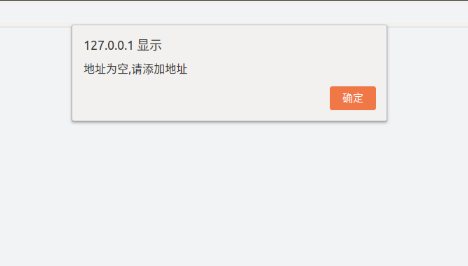

`添加地址展示`

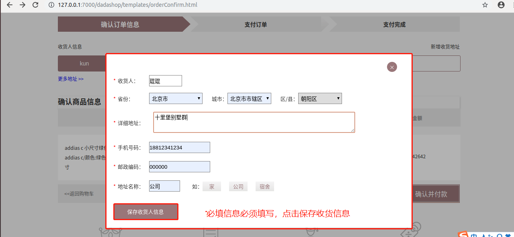

`确认订单页展示数据`

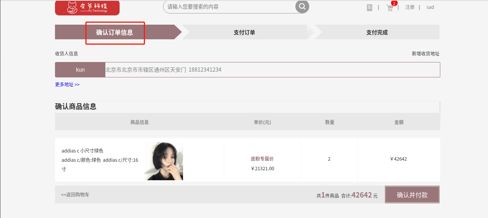

#### 2.请求:

- **URL：**http://127.0.0.1:8000/v1/orders/[username]/advance

- **请求方式:**GET

- **请求参数:**

|      参数       | 类型 | 是否必须 | 说明     |
| :-------------: | :--: | :------: | -------- |
| settlement_type | int  |    是    | 结算类型 |

- **请求示例:**

```python
http://127.0.0.1:8000/v1/orders/sad/advance?settlement_type=0
```

#### 3.响应:

- **返回值类型:**JSON

- **响应内容:**

  | 字段 | 含义     | 类型 | 备注                        |
  | ---- | -------- | ---- | --------------------------- |
  | code | 状态码   | int  | 默认正常为200，异常见状态码 |
  | data | 具体数据 | dict | 与error二选一               |
  
- **响应格式:**

  ```python
  {"code":200,"data":data}
  ```

- **data参数信息:**

  |   参数    | 类型 | 是否必须 |       说明       |
  | :-------: | :--: | :------: | :--------------: |
  | addresses | list |    是    | 用户收货地址列表 |
  | sku_list  | list |    是    |     商品信息     |
  
- **data数据示例:**

  ```python
  {
   "addresses":
   	[ 
        {
          "id":1,
          "name":"guoxiao",
          "mobile":"13488873110",
          "title":"家",
          "address":"北京市北京市市辖区东城区啊啊啊"
        }
      ],
   "sku_list":
      [
        {
          "id":2,
          "name":"安踏A红色大尺寸",
          "count":1,
          "selected":1,
          "default_image_url":"2_i2NMNkA.png",
          "price":"200.00",
          "sku_sale_attr_name":["安踏A/尺寸","安踏A/颜色"],
          "sku_sale_attr_val":["18寸","红色"]
        }
      ]
   }
  ```
  
- **状态码参考:**

  | 状态码 | 响应信息           |
  | ------ | ------------------ |
  | 200    | 正常               |
  | 50100  | 用户未添加收货地址 |

### 2.生成订单API

#### 1.事件触发：

`点击确认并付款按钮`

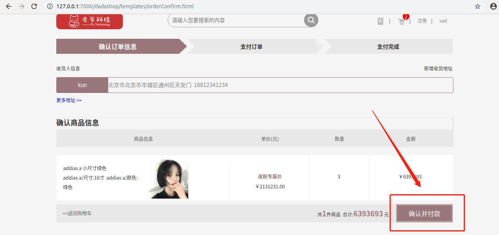

`订单支付页展示`

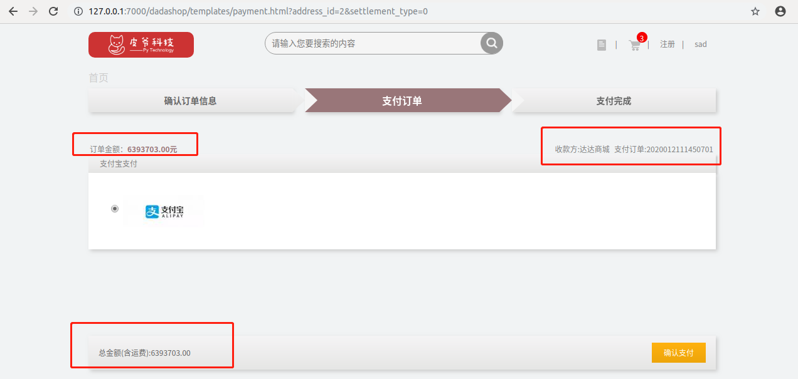

`点击确认并支付`

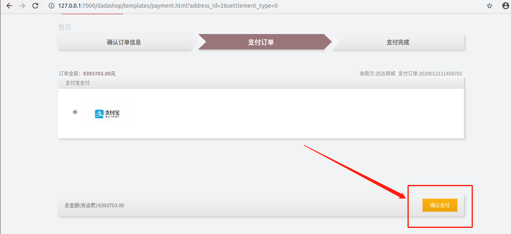


#### 2.请求

- **URL：**http://127.0.0.1:8000/v1/orders/[username]

- **请求方式：**POST

- **请求参数:**

|    参数    | 类型 | 是否必须 | 说明       |
| :--------: | :--: | :------: | ---------- |
| address_id | int  |    是    | 收获地址id |

- **请求示例:**

```python
http://127.0.0.1:8000/v1/orders/sad
```

#### 3.响应:

- **返回值类型:**JSON

- **响应内容:**

  | 字段  | 含义     | 类型 | 备注                        |
  | ----- | -------- | ---- | --------------------------- |
  | code  | 状态码   | int  | 默认正常为200，异常见状态码 |
  | data  | 具体数据 | dict | 与error二选一               |
  | error | 错误信息 | char | 与data二选一                |

- **响应格式:**

  ```python
  {"code":200,"data":data}
  ```

- **data参数信息:**

  |     参数     |   类型   | 是否必须 |      说明      |
  | :----------: | :------: | :------: | :------------: |
  |    saller    |   str    |    是    |    商家名称    |
  | total_amount | decimail |    是    |     总价格     |
  |   order_id   |   str    |    是    |     订单号     |
  |   pay_url    |   str    |    是    | 第三方支付路由 |

- **data数据示例:**

  ```python
     [{'saller': '达达商城',
       'total_amount': 1314,
       'order_id': 2020021601,
       'pay_url': 'http://alipay.com/xxx/xx/'
        }]
  ```

- **error参数信息:**

  |  参数  | 类型 | 是否必须 |     说明     |
  | :----: | :--: | :------: | :----------: |
  | errmsg | str  |    是    | 错误信息说明 |

- **error数据示例:**

  ```python
   [{
       "errmsg":""
   }]
  ```

- **状态码参考:**

  | 状态码 | 响应信息            |
  | ------ | ------------------- |
  | 200    | 正常                |
  | 50104  | 操作太快,清扫后重试 |
  | 50103  | 商品X库存不足       |
  | 50102  | 收货地址无效        |

### 3.订单查询API

#### 1.事件触发

在登录状态下才可查看订单信息

`任意页面header点击订单图标`

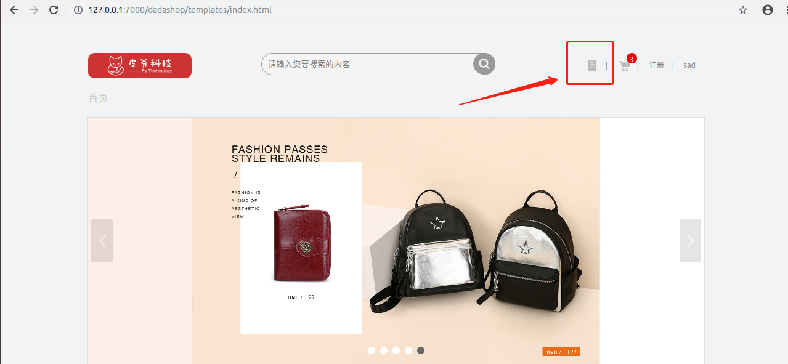

`点击全部订单，即可查看全部订单`

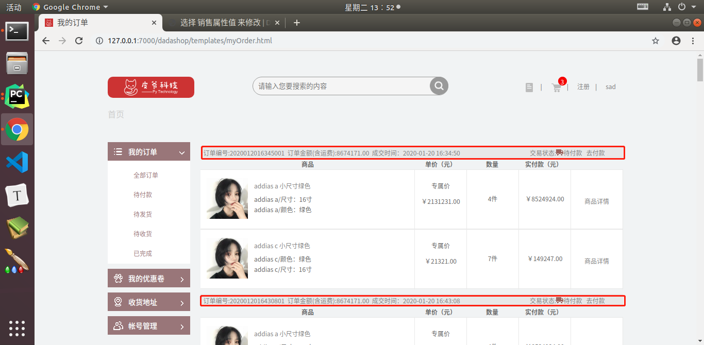

`订单页点击待付款按钮，即可查看待付款的订单`


`订单页点击待发货(待收货,已完成)按钮，即可查看待发货(待收货,已完成)的订单`

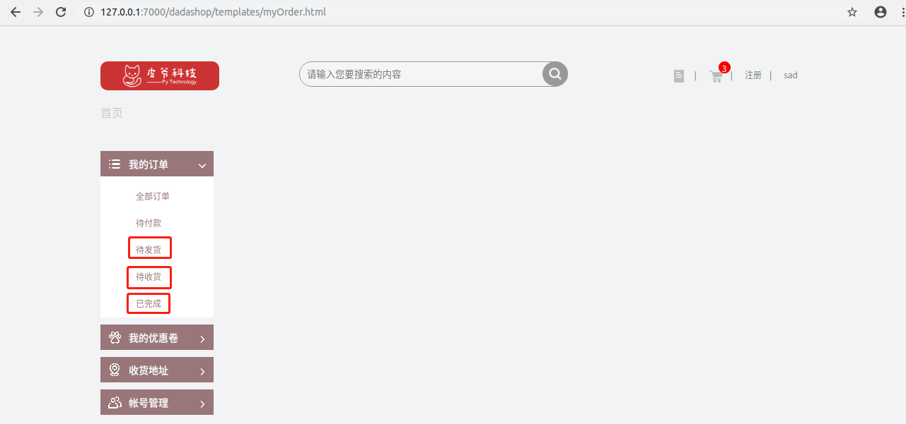

#### 2.请求:

- **URL：**http://127.0.0.1:8000/v1/orders/[username]

- **请求方式:**GET

- **请求参数:**

| 参数 | 类型 | 是否必须 | 说明     |
| :--: | :--: | :------: | -------- |
| type | str  |    是    | 订单状态 |

- **请求示例:**

```python
http://127.0.0.1:8000/v1/orders/sad?type=0
```

#### 3.响应:

- **返回值类型:**JSON

- **响应内容:**

  | 字段  | 含义     | 类型 | 备注                        |
  | ----- | -------- | ---- | --------------------------- |
  | code  | 状态码   | int  | 默认正常为200，异常见状态码 |
  | data  | 具体数据 | dict | 与error二选一               |
  | error | 错误信息 | char | 与data二选一                |

- **响应格式:**

  ```python
  {"code":200,"data":data}
  ```

- **data参数信息:**

  |    参数     | 类型 | 是否必须 |     说明     |
  | :---------: | :--: | :------: | :----------: |
  | orders_list | list |    是    | 订单信息列表 |

- **data数据示例:**

  ```python
     "data":{"orders_list":[
                 {"order_id":"2019111811504601",
                  "order_total_count":1,
                  "order_total_amount":"209.00",
                  "order_freight":"1.00",
                  "address":{
                      "title":"家",
                      "address":"北京市北京市市辖区东城区珍贝大厦",
                      "mobile":"13691433520",
                      "receiver":"习瓜瓜"},
                  "status":1,
                  "order_sku":[
                         {"id":4,
                          "default_image_url":"2_940nDrI.jpg",
                          "name":"adidas a",
                          "price":"199.00",
                          "count":1,
                          "total_amount":"199.00",
                          "sku_sale_attr_names":[
                              "颜色",
                              "尺寸"],
                          "sku_sale_attr_vals":[
                              "红色",
                              "15寸" ]}],
                  "order_time":"2019-11-18 11:50:46"}]}
  ```

- **error参数信息:**

  |   参数    | 类型 | 是否必须 |     说明     |
  | :-------: | :--: | :------: | :----------: |
  | error_msg | str  |    是    | 错误信息说明 |

- **error数据示例:**

  ```python
   [{
       "error_msg":""
   }]
  ```

- **状态码参考:**

  | 状态码 | 响应信息 |
  | ------ | -------- |
  | 200    | 正常     |

### 4.确认收货API

#### 1.事件触发

在登录状态下才可使用此功能

`用户在订单页点击确认收货按钮`

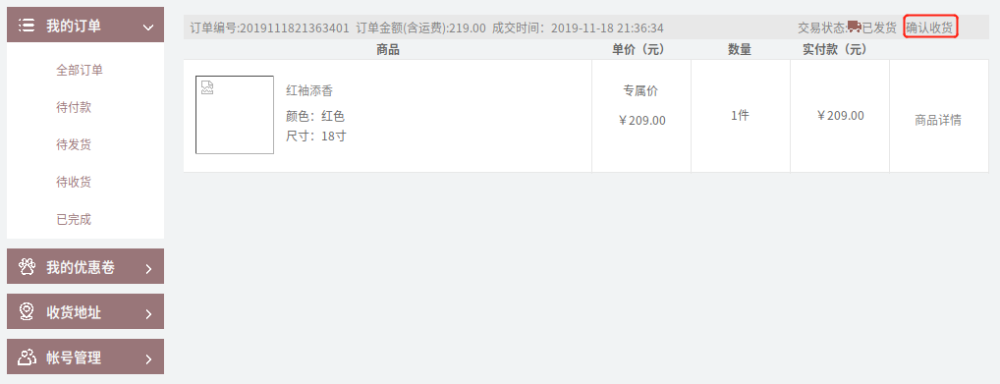

`页面展示`

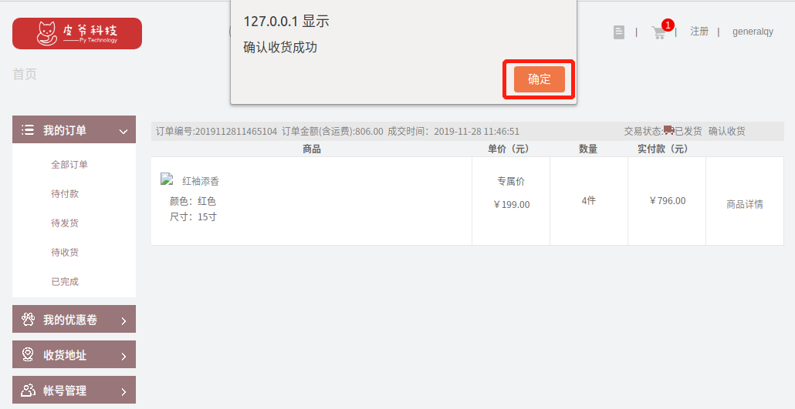

`点击确定后展示`

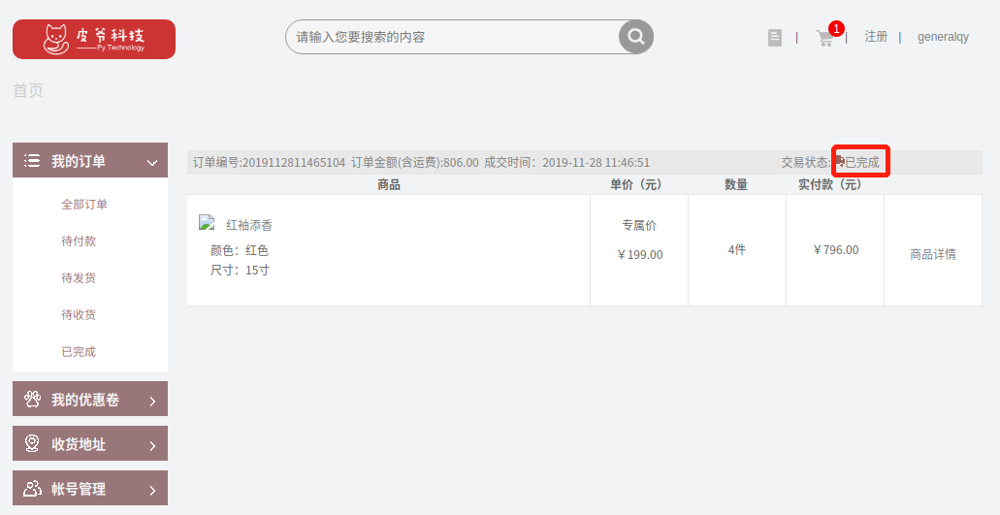

#### 2请求:

- **URL：**http://127.0.0.1:8000/v1/orders/[username]

- **请求方式：**PUT

- **请求参数:**

|   参数   | 类型 | 是否必须 | 说明     |
| :------: | :--: | :------: | -------- |
| order_id | str  |    是    | 订单状态 |

- **请求示例:**

```python
127.0.0.1:8000/v1/orders/sad
```

#### 3.响应:

- **返回值类型:**JSON

- **响应内容:**

  | 字段 | 含义   | 类型 | 备注                        |
  | ---- | ------ | ---- | --------------------------- |
  | code | 状态码 | int  | 默认正常为200，异常见状态码 |

- **响应格式:**

  ```python
  {"code":200}
  ```
