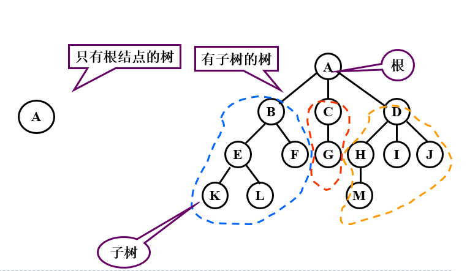

# **Day01回顾**

- **数据结构、算法、程序**

  ```python
  【1】数据结构: 解决问题时使用何种数据类型，数据到底如何保存，只是静态描述了数据元素之间的关系
  【2】算法:    解决问题的方法，为了解决实际问题而设计的，数据结构是算法需要处理的问题载体
  【3】程序:    数据结构 + 算法
  ```
  
- **数据结构分类**

  ```python
  【1】线性结构 : 多个数据元素的有序集合
      1.1) 顺序存储 - 线性表
          a> 定义: 将数据结构中各元素按照其逻辑顺序存放于存储器一片连续的存储空间中
          b> 示例: 顺序表、列表
          c> 特点: 内存连续，溢出时开辟新的连续内存空间进行数据搬迁并存储
  
      1.2) 链式存储 - 线性表
          a> 定义: 将数据结构中各元素分布到存储器的不同点，用记录下一个结点位置的方式建立联系
          b> 示例: 单链表、单向循环链表
          c> 特点:
              单链表: 内存不连续，每个节点保存指向下一个节点的指针，尾节点指针指向"None"
              单向循环链表: 内存不连续，每个节点保存指向下一个节点指针，尾节点指针指向"头节点"
      1.3) 栈 - 线性表
          a> 后进先出 - LIFO
          b> 栈顶进行入栈、出栈操作，栈底不进行任何操作
          c> 顺序存储实现栈、链式存储实现栈
      1.4) 栈 - 线性表
          a> 先进先出 - FIFO
          b> 队尾进行入队操作、队头进行出队操作
          c> 顺序存储实现队列、链式存储实现队列
  ```
  
- **算法效率衡量-时间复杂度T(n)**

  ```python
  【1】定义: 算法执行步骤的数量
  
  【2】分类
      2.1) 最优时间复杂度
      2.2) 最坏时间复杂度 - 平时所说
      2.3) 平均时间复杂度
  
  【3】时间复杂度大O表示法 T(n) = O(??)
      去掉执行步骤的系数、常数、低次幂
  
  【4】常见时间复杂度排序
      O(1)<O(logn)<O(n)<O(nlogn)<O(n2)<O(n2logn)<O(n3)
  ```


# **Day02笔记**

## **昨日作业**

- **题目描述 + 试题解析**

  ```python
  【1】题目描述
      输入一个链表，按链表值从尾到头的顺序返回一个 array_list
  【2】试题解析
      2.1) 将链表中从头节点开始依次取出节点元素，append到array_list中
      2.2) 对列表array_list进行反转
  ```

- **代码实现**

  ```python
  class Node:
      """节点类"""
      def __init__(self,value):
          self.value = value
          self.next = None
  
  # 解决方案
  class Solution:
      # 返回从链表尾部到头部的序列, node为头结点
      def get_array_list(self,node):
          array_list = []
          while node is not None:
              array_list.append(node.value)
              node = node.next
  
          # 将最终列表进行反转,reverse()无返回值,直接改变列表
          array_list.reverse()
  
          return array_list
  
  if __name__ == '__main__':
      s = Solution()
      # 链表(表头->表尾): 100 200 300
      n1 = Node(100)
      n1.next = Node(200)
      n1.next.next = Node(300)
      # 调用反转方法: [300, 200, 100]
      array_list = s.get_array_list(n1)
      print(array_list)
  ```

## **递归**

- **递归定义及特点**

  ```python
  【1】定义
      递归用一种通俗的话来说就是自己调用自己，但是需要分解它的参数，让它解决一个更小一点的问题，当问题小到一定规模的时候，需要一个递归出口返回
      
  【2】特点
      2.1) 递归必须包含一个基本的出口，否则就会无限递归，最终导致栈溢出
      2.2) 递归必须包含一个可以分解的问题
      2.3) 递归必须必须要向着递归出口靠近
  ```

- **递归示例1**

  ```python
  def f(n):
      if n == 0:
          return 
      print(n)
      f(n-1)
  
  f(3)
  # 结果: 3 2 1
  ```

- 


- **递归示例2**

  ```python
  def f(n):
    if n == 0:
      return 
    f(n-1)
    print(n)
    
  f(3)
  # 结果: 1 2 3
  ```

  

- **递归示例3**

  ```python
  # 打印 1+2+3+...+n 的和
  def sumn(n):
    if n == 0:
      return 0
    return n + sumn(n-1)
  
  print(sumn(3))
  ```

  

- **递归练习**

  ```python
  # 使用递归求出 n 的阶乘
  def fac(n):
    if n == 1:
      return 1
    return n * fac(n-1)
  
  print(fac(5))
  ```

- **递归总结**

  ```python
  # 前三条必须记住
  【1】递归一定要有出口,一定是先递推,再回归
  【2】调用递归之前的语句，从外到内执行，最终回归
  【3】调用递归或之后的语句，从内到外执行，最终回归
  
  【4】Python默认递归深度有限制，当递归深度超过默认值时，就会引发RuntimeError，默认值998
  【5】手动设置递归调用深度
      import sys
      sys.setrecursionlimit(1000000) #表示递归深度为100w
  ```

## **冒泡排序**

- **排序方式**

  ```python
  # 排序方式
  遍历列表并比较相邻的元素对，如果元素顺序错误，则交换它们。重复遍历列表未排序部分的元素，直到完成列表排序
  
  # 时间复杂度
  因为冒泡排序重复地通过列表的未排序部分，所以它具有最坏的情况复杂度O(n^2)
  ```


- **代码实现**

  ```python
  """
  冒泡排序
  3 8 2 5 1 4 6 7
  """
  def bubble_sort(li):
      # 代码第2步: 如果不知道循环几次，则举几个示例来判断
      for j in range(0,len(li)-1):
          # 代码第1步: 此代码为一波比对，此段代码一定一直循环，一直比对多次至排序完成
          for i in range(0,len(li)-j-1):
              if li[i] > li[i+1]:
                  li[i],li[i+1] = li[i+1],li[i]
  
      return li
  
  li = [3,8,2,5,1,4,6,7]
  print(bubble_sort(li))
  ```

## **归并排序**

- **排序规则**

  ```python
  # 思想
  分而治之算法
  
  # 步骤
  1) 连续划分未排序列表，直到有N个子列表，其中每个子列表有1个"未排序"元素，N是原始数组中的元素数
  2) 重复合并，即一次将两个子列表合并在一起，生成新的排序子列表，直到所有元素完全合并到一个排序数组中
  ```

  

  

- **代码实现 - 归并排序**

  ```python
  """
  归并排序
  """
  
  def merge_sort(li):
      # 递归出口
      if len(li) == 1:
          return li
  
      # 第1步：先分
      mid = len(li) // 2
      left = li[:mid]
      right = li[mid:]
      # left_li、right_li 为每层合并后的结果,从内到外
      left_li = merge_sort(left)
      right_li = merge_sort(right)
  
      # 第2步：再合
      return merge(left_li,right_li)
  
  # 具体合并的函数
  def merge(left_li,right_li):
      result = []
      while len(left_li)>0 and len(right_li)>0:
          if left_li[0] <= right_li[0]:
              result.append(left_li.pop(0))
          else:
              result.append(right_li.pop(0))
      # 循环结束,一定有一个列表为空,将剩余的列表元素和result拼接到一起
      result += left_li
      result += right_li
  
      return result
  
  if __name__ == '__main__':
      li = [1,8,3,5,4,6,7,2]
      print(merge_sort(li))
  ```

## **快速排序**

- **排序规则**

  ```python
  【1】介绍
      快速排序也是一种分而治之的算法，在大多数标准实现中，它的执行速度明显快于归并排序
  
  【2】排序步骤：
      2.1) 首先选择一个元素，称为数组的基准元素
      2.2) 将所有小于基准元素的元素移动到基准元素的左侧；将所有大于基准元素的移动到基准元素的右侧
      2.3) 递归地将上述两个步骤分别应用于比上一个基准元素值更小和更大的元素的每个子数组
  ```

  

- **代码实现 - 快速排序**

  ```python
  """
  快速排序
      1、left找比基准值大的暂停
      2、right找比基准值小的暂停
      3、交换位置
      4、当right<left时，即为基准值的正确位置，最终进行交换
  """
  def quick_sort(li, first, last):
      if first > last:
          return
  
      # 找到基准值的正确位置下表索引
      split_pos = part(li, first, last)
      # 递归思想,因为基准值正确位置左侧继续快排,基准值正确位置的右侧继续快排
      quick_sort(li, first, split_pos-1)
      quick_sort(li, split_pos+1, last)
  
  
  def part(li, first, last):
      """找到基准值的正确位置,返回下标索引"""
      # 基准值、左游标、右游标
      mid = li[first]
      lcursor = first + 1
      rcursor = last
      sign = False
      while not sign:
          # 左游标右移 - 遇到比基准值大的停
          while lcursor <= rcursor and li[lcursor] <= mid:
              lcursor += 1
          # 右游标左移 - 遇到比基准值小的停
          while lcursor <= rcursor and li[rcursor] >= mid:
              rcursor -= 1
          # 当左游标 > 右游标时,我们已经找到了基准值的正确位置,不能再移动了
          if lcursor > rcursor:
              sign = True
              # 基准值和右游标交换值
              li[first],li[rcursor] = li[rcursor],li[first]
          else:
              # 左右游标互相交换值
              li[lcursor],li[rcursor] = li[rcursor],li[lcursor]
  
      return rcursor
  
  if __name__ == '__main__':
      li = [6,5,3,1,8,7,2,4,666,222,888,0,6,5,3]
      quick_sort(li, 0, len(li)-1)
  
      print(li)
  ```

## **树形结构**

- **定义**

  ```python
  树（Tree）是n（n≥0）个节点的有限集合T，它满足两个条件：有且仅有一个特定的称为根（Root）的节点；其余的节点可以分为m（m≥0）个互不相交的有限集合T1、T2、……、Tm，其中每一个集合又是一棵树，并称为其根的子树（Subtree）
  ```



- **基本概念** 

  ```python
  # 1. 树的特点
  * 每个节点有零个或者多个子节点
  * 没有父节点的节点称为根节点
  * 每一个非根节点有且只有一个父节点
  * 除了根节点外,每个子节点可以分为多个不相交的子树
  
  # 2. 相关概念
  1) 节点的度: 一个节点的子树的个数
  2) 树的度: 一棵树中,最大的节点的度成为树的度
  3) 叶子节点: 度为0的节点
  4) 父节点
  5) 子节点
  6) 兄弟节点
  7) 节点的层次: 从根开始定义起,根为第1层
  8) 深度: 树中节点的最大层次
  ```


## **二叉树**

- **定义**

  ```python
  二叉树（Binary Tree）是n（n≥0）个节点的有限集合，它或者是空集（n＝0），或者是由一个根节点以及两棵互不相交的、分别称为左子树和右子树的二叉树组成。二叉树与普通有序树不同，二叉树严格区分左孩子和右孩子，即使只有一个子节点也要区分左右
  ```


- **二叉树的分类 - 见图**

  ```python
  【1】满二叉树
      所有叶节点都在最底层的完全二叉树
  
  【2】完全二叉树
      对于一颗二叉树，假设深度为d，除了d层外，其它各层的节点数均已达到最大值，并且第d层所有节点从左向右连续紧密排列
      
  【3】二叉排序树
      任何一个节点，所有左边的值都会比此节点小，所有右边的值都会比此节点大
      
  【4】平衡二叉树
      当且仅当任何节点的两棵子树的高度差不大于1的二叉树
  ```

- **二叉树 - 添加元素代码实现**

  ```python
  """
  二叉树
  """
  
  class Node:
      def __init__(self, value):
          self.value = value
          self.left = None
          self.right = None
  
  class Tree:
      def __init__(self, node=None):
          """创建了一棵空树或者是只有树根的树"""
          self.root = node
  
      def add(self, value):
          """在树中添加一个节点"""
          node = Node(value)
          # 空树情况
          if self.root is None:
              self.root = node
              return
  
          # 不是空树的情况
          node_list = [self.root]
          while node_list:
              cur = node_list.pop(0)
              # 判断左孩子
              if cur.left is None:
                  cur.left = node
                  return
              else:
                  node_list.append(cur.left)
  
              # 判断右孩子
              if cur.right is None:
                  cur.right = node
                  return
              else:
                  node_list.append(cur.right)
  ```

### **广度遍历 - 二叉树**


- **广度遍历 - 代码实现**

  ```python
      def breadth_travel(self):
          """广度遍历 - 队列思想（即：列表的append()方法 和 pop(0) 方法"""
          # 1、空树的情况
          if self.root is None:
              return
          # 2、非空树的情况
          node_list = [self.root]
          while node_list:
              cur = node_list.pop(0)
              print(cur.value, end=' ')
              # 添加左孩子
              if cur.left is not None:
                  node_list.append(cur.left)
              # 添加右孩子
              if cur.right is not None:
                  node_list.append(cur.right)
  
          print()
  ```

### **深度遍历 - 二叉树**

```python
【1】遍历
    沿某条搜索路径周游二叉树，对树中的每一个节点访问一次且仅访问一次。

【2】遍历方式
    2.1) 前序遍历： 先访问树根，再访问左子树，最后访问右子树 - 根 左 右
    2.2) 中序遍历： 先访问左子树，再访问树根，最后访问右子树 - 左 根 右
    2.3) 后序遍历： 先访问左子树，再访问右子树，最后访问树根 - 左 右 根
```


```python
【1】前序遍历结果: 1 2 4 8 9 5 10 3 6 7
【2】中序遍历结果: 8 4 9 2 10 5 1 6 3 7
【3】后序遍历结果: 8 9 4 10 5 2 6 7 3 1
```

- **深度遍历 - 代码实现**

  ```python
  # 前序遍历
      def pre_travel(self, node):
          """前序遍历 - 根左右"""
          if node is None:
              return
  
          print(node.value, end=' ')
          self.pre_travel(node.left)
          self.pre_travel(node.right)
  
  # 中序遍历
      def mid_travel(self, node):
          """中序遍历 - 左根右"""
          if node is None:
              return
  
          self.mid_travel(node.left)
          print(node.value, end=' ')
          self.mid_travel(node.right)
  
  # 后续遍历
      def last_travel(self, node):
          """后序遍历 - 左右根"""
          if node is None:
              return
  
          self.last_travel(node.left)
          self.last_travel(node.right)
          print(node.value, end=' ')
  ```

- **二叉树完整代码**

  ```python
  """
  python实现二叉树
  """
  
  class Node:
      def __init__(self, value):
          self.value = value
          self.left = None
          self.right = None
  
  class Tree:
      def __init__(self, node=None):
          """创建了一棵空树或者是只有树根的树"""
          self.root = node
  
      def add(self, value):
          """在树中添加一个节点"""
          node = Node(value)
          # 空树情况
          if self.root is None:
              self.root = node
              return
  
          # 不是空树的情况
          node_list = [self.root]
          while node_list:
              cur = node_list.pop(0)
              # 判断左孩子
              if cur.left is None:
                  cur.left = node
                  return
              else:
                  node_list.append(cur.left)
  
              # 判断右孩子
              if cur.right is None:
                  cur.right = node
                  return
              else:
                  node_list.append(cur.right)
  
      def breadth_travel(self):
          """广度遍历 - 队列思想（即：列表的append()方法 和 pop(0) 方法"""
          # 1、空树的情况
          if self.root is None:
              return
          # 2、非空树的情况
          node_list = [self.root]
          while node_list:
              cur = node_list.pop(0)
              print(cur.value, end=' ')
              # 添加左孩子
              if cur.left is not None:
                  node_list.append(cur.left)
              # 添加右孩子
              if cur.right is not None:
                  node_list.append(cur.right)
  
          print()
  
      def pre_travel(self, node):
          """前序遍历 - 根左右"""
          if node is None:
              return
  
          print(node.value, end=' ')
          self.pre_travel(node.left)
          self.pre_travel(node.right)
  
      def mid_travel(self, node):
          """中序遍历 - 左根右"""
          if node is None:
              return
  
          self.mid_travel(node.left)
          print(node.value, end=' ')
          self.mid_travel(node.right)
  
      def last_travel(self, node):
          """后序遍历 - 左右根"""
          if node is None:
              return
  
          self.last_travel(node.left)
          self.last_travel(node.right)
          print(node.value, end=' ')
  
  if __name__ == '__main__':
      tree = Tree()
      tree.add(1)
      tree.add(2)
      tree.add(3)
      tree.add(4)
      tree.add(5)
      tree.add(6)
      tree.add(7)
      tree.add(8)
      tree.add(9)
      tree.add(10)
      # 广度遍历：1 2 3 4 5 6 7 8 9 10
      tree.breadth_travel()
      # 前序遍历：1 2 4 8 9 5 10 3 6 7
      tree.pre_travel(tree.root)
      print()
      # 中序遍历:8 4 9 2 10 5 1 6 3 7
      tree.mid_travel(tree.root)
      print()
      # 后序遍历：8 9 4 10 5 2 6 7 3 1
      tree.last_travel(tree.root)
  ```


